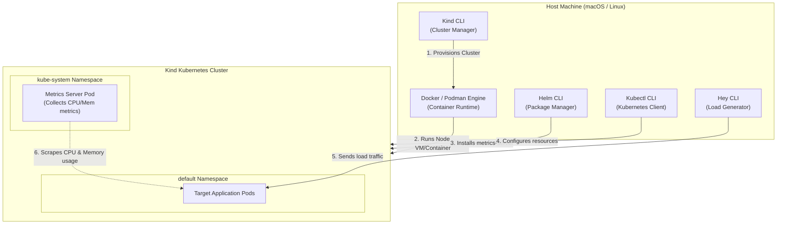

# Lab 1: Set Up the Course Lab Environment

In this lab, we configure the local environment with the tools needed to build, deploy, monitor, and autoscale our application.

### 🌐 Lab Architecture Flow



### 🛠️ Role of Each Component
1. **Docker/Podman**: Serves as the base container runtime where Kubernetes cluster nodes are run as isolated system containers.
2. **Kind (Kubernetes in Docker)**: Runs a full Kubernetes control-plane and worker nodes within Docker containers on the host.
3. **Kubectl**: The standard CLI tool used to interact with the Kubernetes API server.
4. **Helm**: Simplifies deployment of complex Kubernetes charts (like Prometheus or the metrics-server).
5. **Hey**: A load testing tool to generate synthetic HTTP traffic to trigger autoscaling.
6. **Go**: Used to compile the Fibonacci calculating application.
7. **Metrics Server**: A cluster-wide aggregator of resource usage data. Without this, default HPAs cannot retrieve pod CPU/Memory metrics.

Before we dive into the hands-on activities, let's configure the lab environment with the following tools:
- Docker: used by kind to provision the Kubernetes cluster
- kind: to create Kubernetes clusters
- kubectl: to manage the Kubernetes cluster
- Helm: for Kubernetes package management
- hey: load testing tool
- Go Programming language: to build sample applications
Set Up The Course Lab Environment

### Mac Environment Setup

To set up Docker, follow these steps.
1. Install Docker:
```bash
brew install docker
```
2. Verify installation:
```bash
docker ps
```
To install the latest version of kubectl, execute these commands:
1. Install kubectl:
```bash
brew install kubectl
```
2. Verify installation:
```bash
kubectl version --client
```
To install the latest Helm version, perform these steps.
1. Install Helm:
```bash
brew install helm
```
2. Verify installation:
```bash
helm version --client
```
To install the latest version of hey, execute these commands:
1. Install hey:
```bash
brew install hey
```
2. Verify hey:
```bash
hey --help
```
To install Go Programming Language, execute these commands:
1. Install hey:
```bash
brew install go
```
2. Verify hey:
```bash
go version
```
To install kind, run the following command:
1. Install kind:
```bash
brew install kind
```
2. Create Kubernetes cluster. Lab was tested on version v1.27:
```bash
kind create cluster
```
```text
Creating cluster "kind" ...
✓ Ensuring node image (kindest/node:v1.27.3) 🖼
✓ Preparing nodes 📦

✓ Writing configuration 📜
✓ Starting control-plane 🕹
✓ Installing CNI 🔌
✓ Installing StorageClass 💾
Set kubectl context to "kind-kind"
You can now use your cluster with:
```
```bash
kubectl cluster-info --context kind-kind
```
3. Verify cluster:
```bash
kubectl get ns
```
```text
NAME STATUS AGE
default Active 20s
kube-node-lease Active 20s
kube-public Active 20s
kube-system Active 20s
local-path-storage Active 13s
```

### Linux Environment Setup

While we present various setup options in this section, we will use an Ubuntu 22.04 host and a Kubernetes
cluster set up using kind throughout the remainder of the course.
The provided Linux setup has been tested on the following distributions: Ubuntu 22.04, Debian 11, CentOS
Stream 9, and Amazon Linux 2 on cloud providers like AWS and GCP.
To set up Docker, follow these steps.
1. Install Docker:
```bash
curl -fsSL https://get.docker.com/ | sh
```
2. Enable Docker to start on boot:
```bash
sudo systemctl enable --now docker
```
3. Check that the Docker service is running:
```bash
sudo systemctl status docker
```
4. Add current user to Docker group:
```bash
sudo usermod -aG docker $USER
```
5. Refresh shell session (by exiting & logging in again).
6. Verify Docker installation:
```bash
docker ps
```
To install the latest version of kubectl, execute these commands:
1. Download the binary.
```bash
curl -sSL -O "https://dl.k8s.io/release/$(curl -L -s https://dl.k8s.io/release/stable.txt)/bin/linux/amd64/kubectl"
```
2. Modify permissions:
```bash
chmod +x kubectl
```
3. Move to /usr/local/bin:
```bash
sudo mv kubectl /usr/local/bin
```
To install the latest Helm version, perform the following steps:
1. Download Helm. (If the link doesn't work, update the link with a version from GitHub Releases:)
```bash
curl -sSL -O https://get.helm.sh/helm-v3.13.0-linux-amd64.tar.gz
```
2. Extract the downloaded archive:
```bash
tar -zxf helm-v3.13.0-linux-amd64.tar.gz
```
3. Move the Helm binary to /usr/local/bin:
```bash
sudo mv linux-amd64/helm /usr/local/bin/helm
```
To install the latest version of hey, execute these commands:
1. Download the binary:
```bash
wget https://hey-release.s3.us-east-2.amazonaws.com/hey_linux_amd64
```
2. Modify permissions:
```bash
chmod +x hey_linux_amd64
```
3. Move the Helm binary to /usr/local/bin:
```bash
sudo mv hey_linux_amd64 /usr/local/bin/hey
```
To install the latest version of Golang Programming Language, execute these commands:
1. Download the binary:
```bash
wget https://go.dev/dl/go1.21.7.linux-amd64.tar.gz
```
2. Extract the tarball to /usr/local:
```bash
sudo tar -C /usr/local -xzf go1.21.7.linux-amd64.tar.gz
```
3. To add Go to your PATH, add these lines to your `.bashrc` or `.profile`:
```bash
export PATH=$PATH:/usr/local/go/bin
export GOPATH=$HOME/go
```
4. Apply the profile changes:
```bash
source ~/.profile
```
5. Verify installation
```bash
go version
```
To install kind, run the following command:
1. For AMD64 / x86_64:
```bash
[ $(uname -m) = x86_64 ] && curl -Lo ./kind https://kind.sigs.k8s.io/dl/v0.20.0/kind-linux-amd64
```
2. For ARM64:
```bash
[ $(uname -m) = aarch64 ] && curl -Lo ./kind https://kind.sigs.k8s.io/dl/v0.20.0/kind-linux-arm64
```
3. Modify permissions:
```bash
chmod +x ./kind
```
4. Move the kind binary /usr/local/bin:
```bash
sudo mv ./kind /usr/local/bin/kind
```
5. Create cluster:
```bash
kind create cluster
```
```text
Creating cluster "kind" ...
✓ Ensuring node image (kindest/node:v1.27.3) 🖼
✓ Preparing nodes 📦
✓ Writing configuration 📜
✓ Starting control-plane 🕹
✓ Installing CNI 🔌
✓ Installing StorageClass 💾
Set kubectl context to "kind-kind"
You can now use your cluster with:
```
```bash
kubectl cluster-info --context kind-kind
```
6. Verify cluster:
```bash
kubectl get ns
```
```text
NAME STATUS AGE
default Active 20s
kube-node-lease Active 20s
kube-public Active 20s
kube-system Active 20s
local-path-storage Active 13s
```

### Metric Server Setup in Kubernetes

To install metrics server in Kubernetes, execute these commands:
1. Add Helm repository:
```bash
helm repo add metrics-server https://kubernetes-sigs.github.io/metrics-server/
```
2. Install metrics server:
On Mac:
```bash
helm upgrade --install metrics-server metrics-server/metrics-server -n kube-system --set args={--kubelet-insecure-tls}
```
On Linux:
```bash
helm upgrade --install metrics-server metrics-server/metrics-server -n kube-system --set args[0]=--kubelet-insecure-tls
```
3. Verify installation:
```bash
kubectl get pods -n kube-system -l=app.kubernetes.io/name=metrics-server
```
```text
NAME READY STATUS RESTARTS AGE
metrics-server-77dfcbd9f6-sgfgj 1/1 Running 0 2m44s
Congratulations, your environment is ready!
```