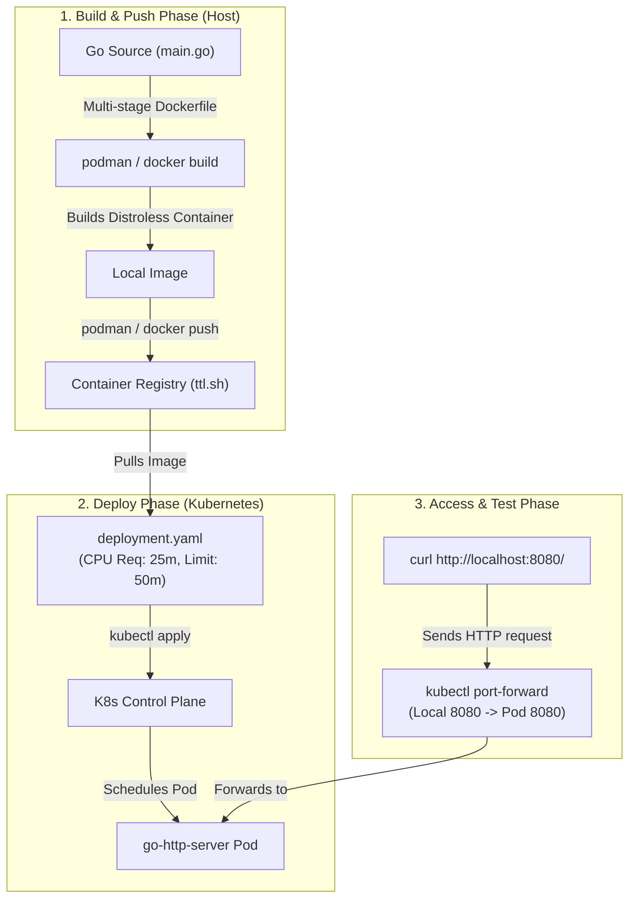

# Lab Exercise 2.1: Containerize and Deploy Sample Application in Kubernetes

In this exercise, we containerize a sample Go HTTP server that computes CPU-intensive Fibonacci numbers, and deploy it to our Kubernetes cluster.

### 🌐 Containerization and Deployment Flow



### 🛠️ Key Concepts & Design Decisions
1. **CPU Intensive Workload**: The application calculates `fib(42)` recursively. Since Fibonacci calculations are exponential ($O(2^n)$ time complexity), running a request generates sustained CPU load, which is excellent for triggering CPU-based horizontal and vertical autoscaling.
2. **Multi-stage Dockerfile**: We build the Go binary in a lightweight Alpine stage (`golang:1.21-alpine`) and then copy the executable to a secure, minimal Google Distroless static base (`gcr.io/distroless/static:nonroot`). This drastically reduces the attack surface and image size.
3. **Resource Requests & Limits**: The pod specifies `requests.cpu: "25m"` (0.025 cores) and `limits.cpu: "50m"` (0.05 cores). Defining these is mandatory for the Kubernetes CPU autoscaler to compute utilization percentages.

## Prerequisites

Kubernetes cluster with Metric Server installed as per Lab 1.

## Lab Exercise

1. Initialize a Golang project using the commands below:
```bash
mkdir httpserver
cd httpserver
go mod init httpserver
```
```text
go: creating new go.mod: module httpserver
go: to add module requirements and sums:
```
```bash
go mod tidy
```
2. Create a main.go file with the following content.
The code provided below sets up an HTTP server with a single API endpoint that calculates Fibonacci
numbers. Fibonacci number calculations are inherently CPU-intensive due to the recursive nature of the
algorithm. As the sequence progresses, the computational effort required increases exponentially. This
characteristic makes it ideal for demonstrating Kubernetes autoscaling.
As the server processes intensive Fibonacci number calculations, it simulates high CPU load conditions.
Kubernetes autoscaling responds to this by dynamically adjusting the number of pods or resources,
showcasing efficient resource management under varying load conditions.
```go
package main

import (
	"fmt"
	"log"
	"net/http"
)

// fib calculates the n-th Fibonacci number
func fib(n int) int {
	if n <= 1 {
		return n
	}
	return fib(n-1) + fib(n-2)
}

func handler(w http.ResponseWriter, r *http.Request) {
	n := 42 // A number that results in considerable computation
	fmt.Fprintf(w, "Fibonacci number at position %d is: %d\n", n, fib(n))
}

func main() {
	http.HandleFunc("/", handler)
	log.Fatal(http.ListenAndServe(":8080", nil))
}
```
3. Create a Dockerfile with the contents below to containerize the sample application.
```dockerfile
FROM golang:1.21-alpine
WORKDIR /app
COPY . .
RUN go build -o httpserver .
FROM gcr.io/distroless/static:nonroot
COPY --from=0 /app/httpserver /httpserver
CMD ["/httpserver"]
```
4. Make sure that the Go version defined in the go.mod file matches the version used in the Dockerfile
(1.21). Refer to the following snippet of the go.mod file:
```text
module httpserver
go 1.21.0
```
5. Execute the following command to build the container image. Replace username with your Docker
username.
```bash
docker build -t username/go-http-server:latest .
docker push username/go-http-server:latest
```
6. Create deployment.yaml file with contents below.
This file defines a Kubernetes deployment for your Sample Application. Be sure to replace the image field
with the respective image name you created while executing the command in step 4.
```yaml
apiVersion: apps/v1
kind: Deployment
metadata:
  name: go-http-server
spec:
  replicas: 1
  selector:
    matchLabels:
      app: go-http-server
  template:
    metadata:
      labels:
        app: go-http-server
    spec:
      containers:
      - name: go-http-server
        imagePullPolicy: IfNotPresent
        image: username/go-http-server:latest
        ports:
        - containerPort: 8080
        resources:
          requests:
            cpu: "25m"
          limits:
            cpu: "50m"
```
7. Deploy the application:
```bash
kubectl apply -f deployment.yaml
```
8. Verify the deployment:
```bash
kubectl get deployments
```
```text
NAME             READY   UP-TO-DATE   AVAILABLE   AGE
go-http-server   1/1     1            1           3m31s
```
9. Set up port forwarding to access the application.
In this step, we are establishing a port forwarding rule that redirects network traffic from a specific port on your
local machine to the corresponding port on the Kubernetes pod hosting the Go HTTP server. By doing so, you
enable direct access to the server via http://localhost:8080 from your local computer. This action bridges the
network gap between your local environment and the isolated Kubernetes pod, allowing you to test and interact
with the deployed application as if it were running locally. It's important to run this in a new terminal tab to
keep the port forwarding active throughout your testing session.
```bash
kubectl port-forward deployment/go-http-server 8080:8080
```
```text
Forwarding from 127.0.0.1:8080 -> 8080
Forwarding from [::1]:8080 -> 8080
```
10. Test the sample application by sending an HTTP request.
```bash
curl http://localhost:8080/
```
```text
Fibonacci number at position 42 is: 267914296
```
Note: It can take a minute or two to display the output. Please be patient.

## Summary

Congratulations! Let’s review the concepts we covered in this lab exercise.
We successfully containerized the Go HTTP server application, which calculates Fibonacci numbers, into a
Docker container. This step demonstrated the practical application of creating a Dockerfile, building a Docker
image, and pushing it to a registry. The application was then deployed to a Kubernetes cluster using a
deployment.yaml file. This exercise provided hands-on experience in defining and applying Kubernetes
deployment configurations. Finally, by setting up port forwarding, we gained experience in how to access and
interact with the deployed application within the Kubernetes environment.