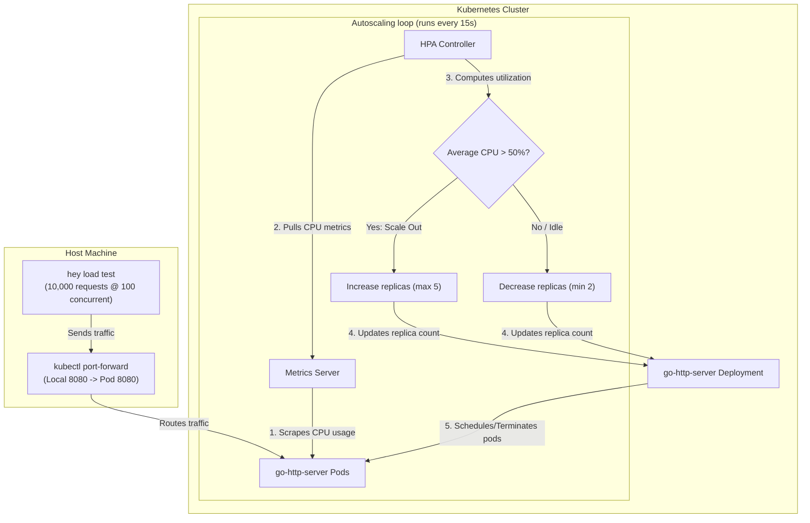
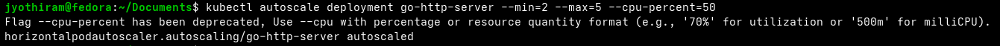
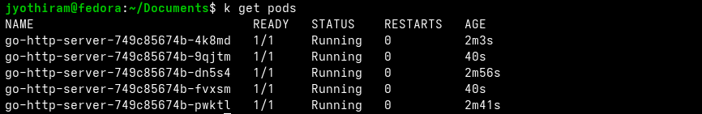

# Lab Exercise 2.2: Configure and Test HPA

In this exercise, we configure the Horizontal Pod Autoscaler (HPA) to scale the number of application pod replicas automatically in response to real-time CPU utilization.

### 🌐 HPA Scaling Lifecycle Loop



### 🛠️ Key Concepts & Mechanics
1. **Metrics Server Scrape Loop**: The metric server queries the kubelet summary API on each node to collect container CPU usage. 
2. **HPA Scaling Formula**: The HPA controller calculates replicas using:
   $$\text{Desired Replicas} = \lceil \text{Current Replicas} \times \frac{\text{Current Metric Value}}{\text{Target Metric Value}} \rceil$$
   If our current CPU usage climbs to 100% (target is 50%), the formula scales replicas up to double their current count.
3. **Cooldown/Stabilization Window**: To prevent rapid scaling fluctuations (known as "thrashing"), Kubernetes enforces a stabilization window (defaulting to 5 minutes for scale down) before removing replicas.

## Prerequisites

1. Kubernetes cluster with Metric Server installed as per Lab 1.
2. Completion of Lab Exercise 2.1.

## Lab Exercise

1. Create an HPA resource:
This resource will autoscale your deployment based on CPU utilization.
In this step, we are creating a Horizontal Pod Autoscaler (HPA) for our Kubernetes deployment using the
```bash
kubectl autoscale command. This HPA is configured to monitor the CPU utilization of your go-http-server
```
deployment. The command kubectl autoscale deployment go-http-server --min=2 --max=5
--cpu-percent=50 sets up the autoscaler with specific parameters: it maintains a minimum of 2 and a
maximum of 5 pod replicas, and it initiates scaling actions when the average CPU utilization across all pods
reaches 50%. When the CPU load exceeds the 50% threshold, the HPA will automatically increase the number
of pod replicas, up to a maximum of 5, to distribute the load and maintain optimal performance. Conversely, if
the CPU usage falls below this threshold, the HPA will reduce the number of replicas, ensuring efficient
resource use.
```bash
kubectl autoscale deployment go-http-server --min=2 --max=5 --cpu-percent=50
```
horizontalpodautoscaler.autoscaling/go-http-server autoscaled
2. Check that HPA is correctly deployed:
```bash
kubectl get hpa
```
NAME REFERENCE TARGETS MINPODS MAXPODS
REPLICAS AGE
go-http-server Deployment/go-http-server <unknown>/50% 2 5
0 41s
Note: Targets shows as <unknown> while the metric server is scraping the metrics. No action is needed and it will display the current metric value.



3. Generate load using hey:
In this step, we are using the hey tool to generate traffic for our application. This simulated traffic specifically
targets the CPU-intensive operations of the Fibonacci number calculations, creating a high CPU load scenario.
As the CPU usage increases beyond the thresholds set for the Horizontal Pod Autoscaler (HPA), it triggers an
automatic response from HPA. The HPA will then scale up the number of pod replicas to handle this increased
load. This scaling up ensures that the application maintains its performance and responsiveness despite the
heightened demand.
```bash
hey -n 10000 -c 100 http://localhost:8080/
```
4. Monitor autoscaling:
In this step, we are actively monitoring the behavior of the Horizontal Pod Autoscaler (HPA) as it responds to
the increased load. By executing kubectl get hpa, you can observe the HPA's real-time response to
changing CPU utilization. This command displays crucial metrics such as current CPU usage, targeted usage
(set at 50% in our configuration), and the current number of replicas.
As discussed in the chapter, the HPA operates by continually monitoring specified metrics - in this case, CPU
utilization - and adjusting the number of pod replicas to meet the desired target utilization. When the load
increases and CPU usage rises above the 50% threshold, the HPA responds by scaling up the number of
pods.
```bash
kubectl get hpa -w
```
NAME REFERENCE TARGETS MINPODS MAXPODS
REPLICAS AGE
go-http-server Deployment/go-http-server 50%/50% 2 5
4 12m
The above output shows that the Horizontal Pod Autoscaler (HPA) has scaled the go-http-server deployment
to 4 replicas. This scaling action is a direct response to increased CPU utilization, which has surpassed the
defined threshold of 50%. The important aspects to note here are the following:
- TARGETS: Indicates the current/average CPU utilization (50%) against the target set (50%). The match
here triggered the scaling.
- MINPODS and MAXPODS: Represent the minimum (2) and maximum (5) number of pods that HPA can
scale to. In this case, the number of replicas has increased but is still within the defined limits.
- REPLICAS: Shows the current count of replicas (4), which has increased from the original count to
handle the higher load.



5. HPA clean-up, delete HPA and redeploy sample application deployment:
```bash
kubectl delete hpa go-http-server
kubectl apply -f deployment.yaml
```
6. Close the load generator by pressing ctrl + c

## Summary

Congratulations on completing the second exercise! Let’s review what we learned.
We configured the Horizontal Pod Autoscaler (HPA) in Kubernetes, linking it to the deployed Go HTTP server
application to demonstrate automatic scaling based on CPU usage. Then, we used the hey tool to generate a
high CPU load, triggering the HPA to increase the number of pod replicas, thereby illustrating Kubernetes'
ability to handle increased demand. Finally, we gained practical insights into how Kubernetes HPA responds to
varying loads, ensuring efficient resource utilization and maintaining application performance.