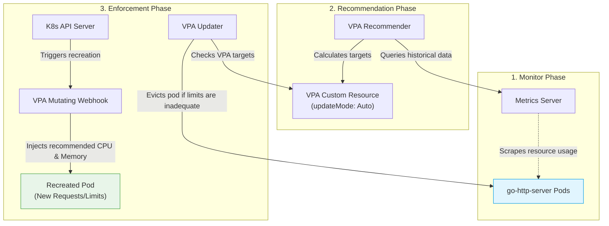
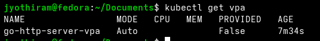
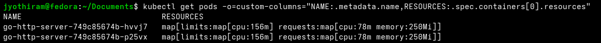

# Lab Exercise 2.3: Configure and Test VPA

In this exercise, we deploy the Vertical Pod Autoscaler (VPA) in 'Auto' mode to automatically adjust CPU and memory allocations (requests and limits) for our application pods based on real-time resource utilization.

### 🌐 VPA Operational Lifecycle



### 🛠️ Key Concepts & Mechanics
1. **The Three VPA Components**:
   - **Recommender**: Monitors resource consumption (via metrics-server) and computes recommended resource values.
   - **Updater**: Monitors pod resource requests and evicts pods whose resource requests deviate significantly from recommendations.
   - **Admission Controller (Mutating Webhook)**: Intercepts pod creation requests and modifies the container requests/limits with the VPA recommender's targets before the pod is scheduled.
2. **Auto vs. Initial/Recommendation-Only Modes**:
   - **Auto**: Evicts running pods and applies recommendations during pod startup.
   - **Initial**: Assigns recommendations only when pods are newly created, never evicting running pods.
   - **Off (Recommendation-Only)**: Only calculates recommendations, leaving actuation to the administrator.

## Prerequisites

1. Kubernetes cluster with Metric Server installed as per Lab 1.
2. Completion of Lab Exercises 2.1 and 2.2.

## Lab Exercise

After setting up and testing the Horizontal Pod Autoscaler (HPA), let's proceed to deploy the Vertical Pod
Autoscaler (VPA) in 'Auto' mode to observe its autoscaling functionality.
1. Install the Vertical Pod Autoscaler CRDs by executing the command below in a new terminal.
```bash
git clone https://github.com/kubernetes/autoscaler.git
cd autoscaler/vertical-pod-autoscaler
```
./hack/vpa-up.sh
```bash
kubectl get pods -n kube-system | grep "vpa"
```
```text
vpa-admission-controller-754ccfdf99-5mjrh 1/1 Running 0
vpa-recommender-667f9769fb-hsspf 1/1 Running 0
vpa-updater-696b8787f9-vlfls 1/1 Running 0
```
2. Create a VPA Resource in 'Auto' Mode:
To deploy VPA in 'Auto' mode, you will create a VPA configuration that will automatically update the resource
requests for the pods based on their usage. Create vpa-auto.yaml with the contents below:
```yaml
apiVersion: "autoscaling.k8s.io/v1"
kind: VerticalPodAutoscaler
metadata:
name: go-http-server-vpa
spec:
targetRef:
apiVersion: "apps/v1"
kind: Deployment
name: go-http-server
updatePolicy:
updateMode: "Auto"
```
3. Apply the VPA Configuration:
```bash
kubectl apply -f vpa-auto.yaml
```
4. Verify the VPA deployment:
Ensure that the VPA is running and targeting your deployment:
```bash
kubectl get vpa
```
NAME MODE CPU MEM PROVIDED AGE
go-http-server-vpa Auto 90s



5. Use the command below, to check the default limits of the application.
```bash
kubectl get pods
```
-o=custom-columns="NAME:.metadata.name,RESOURCES:.spec.containers[0].resources"
NAME RESOURCES
go-http-server-6f8c7c6c56-fs2qh map[limits:map[cpu:50m] requests:map[cpu:10m]]
6. In this step, we are using the hey tool to generate load on the application, similar to the test conducted for
HPA. However, this time we will observe the behavior of the Vertical Pod Autoscaler (VPA) under load. As the
CPU and memory demands increase due to the generated traffic, VPA will analyze these changing
requirements and adjust the resource limits of the pods accordingly. This is different from HPA’s approach of
scaling the number of pods. VPA’s adjustments may include increasing CPU and memory limits to ensure the
application continues to perform optimally under higher load.
```bash
hey -n 10000 -c 100 http://localhost:8080/
```
7. Wait for 2-3 minutes for VPA to start adjusting the limits. Check the VPA's resource recommendations by
using the following command:
```bash
kubectl describe vpa go-http-server-vpa | grep "Status:" -A 100
```
Status:
Conditions:
Last Transition Time: 2024-01-19T13:44:16Z
Status: True
Type: RecommendationProvided
Recommendation:
Container Recommendations:
Container Name: go-http-server
Lower Bound:
Cpu: 25m
Memory: 262144k
Target:
Cpu: 63m
Memory: 262144k
Uncapped Target:
Cpu: 63m
Memory: 262144k
Upper Bound:
Cpu: 167m
Memory: 2191555258
Events: <none>
8. Observe changes in the pods' resource requests:
Note that VPA might restart pods to apply new resource requests, which is part of its normal operation
in 'Auto' mode.
```bash
kubectl get pods
```
-o=custom-columns="NAME:.metadata.name,RESOURCES:.spec.containers[0].resources"
NAME RESOURCES
go-http-server-84b745454d-dtmn4 map[limits:map[cpu:62m] requests:map[cpu:25m memory:262144k]]

As you can observe from the above output, VPA has changed request limits from 50 to 62 and added memory requests of 256MB.


9. Remove the port forwarding, terminate the kubectl port-forward command from the terminal using
ctrl + c
10. Delete VPA and the sample application:
```bash
kubectl delete vpa go-http-server-vpa
kubectl delete deployment go-http-server
```

## Summary

Let’s recap the concepts that we explored in this exercise.
First, we implemented the Vertical Pod Autoscaler (VPA) in 'Auto' mode to automatically adjust pod resources
based on usage. Next, we conducted load testing using hey and observed how VPA dynamically modifies pod
resource limits (CPU and memory) in response to the workload, showcasing the adaptability of the VPA under
varying load conditions.