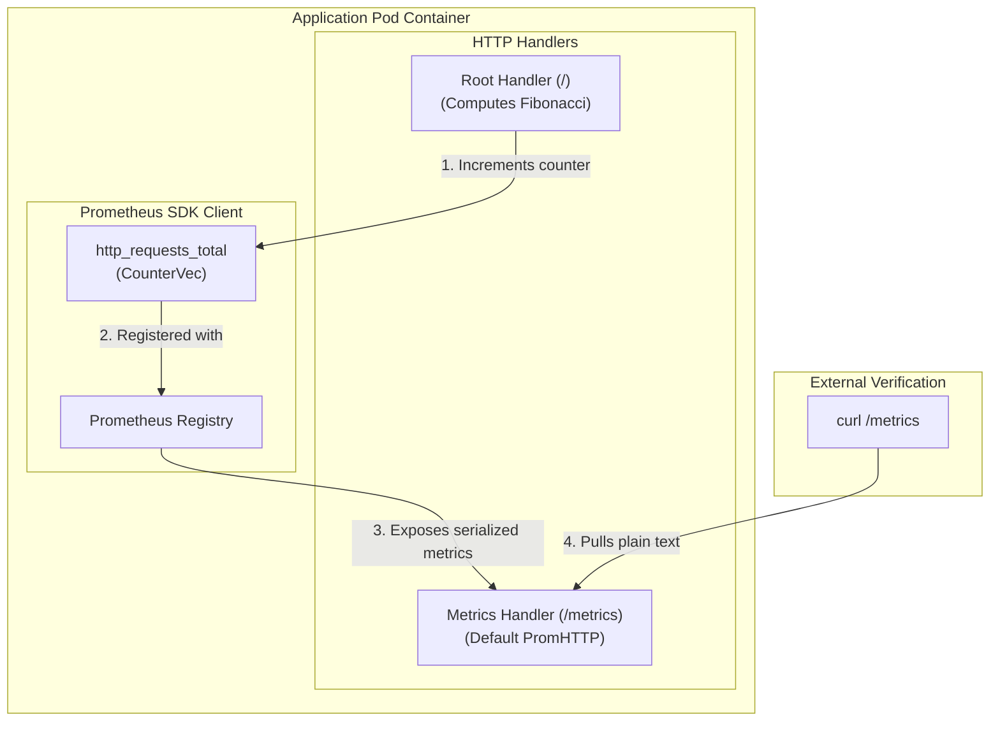
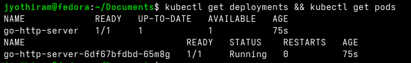
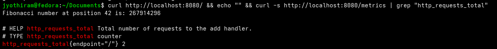

# Lab Exercise 3.1: Containerize and Deploy Instrumented Sample Application in Kubernetes

In this exercise, we instrument our Go HTTP application with the Prometheus Go SDK client to expose custom counters that can track the rate of HTTP requests per second.

### 🌐 Metrics Exposure Flow



### 🛠️ Key Concepts & Design Decisions
1. **Instrumenting with Prometheus SDK**:
   - **CounterVec**: A multi-dimensional metric that allows us to count occurrences (like total HTTP requests) and attach labels (like `endpoint="/"`) to filter or group metrics in Prometheus.
   - **`/metrics` endpoint**: Managed by `promhttp.Handler()`, this endpoint formats all registered metrics into the standard Prometheus exposition text format (ASCII).
2. **Prometheus Scrape Metadata**:
   - In `deployment.yaml`, we add `prometheus.io/scrape: "true"` label/annotation. While this doesn't trigger scrapes by itself, it's used by target discovery rules in Prometheus to automatically configure scraping endpoints.

## Prerequisites

Kubernetes cluster with Metric Server installed as per Lab 1.

## Lab Exercise

1. Initialize a Golang project using the following commands:
```bash
mkdir -p lab3/httpserver
cd lab/httpserver
go mod init httpserver
```
```text
go: creating new go.mod: module httpserver
go: to add module requirements and sums:
```
```bash
go mod tidy
```
2. Create a main.go file with the following content.
This Go application sets up an HTTP server featuring a single API endpoint designed to compute Fibonacci
numbers. This application closely resembles the one utilized in Lab 02.1, but with a slight change: it's now
instrumented to emit metrics in the Prometheus format, making it suitable for monitoring purposes.
Every time a request is made to calculate a Fibonacci number, the application not only performs the
computation but also increments a Prometheus metric named http_requests_total. This metric acts as a
counter, tracking the total number of requests received by the server. We will use this metric to auto scale the
application on the basis of http requests.
```go
package main

import (
	"fmt"
	"log"
	"net/http"
	"strconv"

	"github.com/prometheus/client_golang/prometheus"
	"github.com/prometheus/client_golang/prometheus/promhttp"
)

var (
	// Define a counter metric for the /add handler
	addRequests = prometheus.NewCounterVec(
		prometheus.CounterOpts{
			Name: "http_requests_total",
			Help: "Total number of requests to the add handler.",
		},
		[]string{"endpoint"},
	)
)

func init() {
	// Register custom metrics with Prometheus
	prometheus.MustRegister(addRequests)
}

// fib calculates the n-th Fibonacci number
func fib(n int) int {
	if n <= 1 {
		return n
	}
	return fib(n-1) + fib(n-2)
}

var count int

func handler(w http.ResponseWriter, r *http.Request) {
	addRequests.WithLabelValues("/").Inc()
	count++
	fmt.Printf("Request number is: %d\n", count)
	defaultNumber := 42
	numberStr := r.URL.Query().Get("number")

	n := defaultNumber
	if numberStr != "" {
		parsedNumber, err := strconv.Atoi(numberStr)
		if err != nil {
			// Handle the error in case of bad input
			fmt.Fprintf(w, "Invalid number format: %s\n", numberStr)
			return
		}
		if parsedNumber != 0 {
			n = parsedNumber
		}
	}
	fmt.Fprintf(w, "Fibonacci number at position %d is: %d\n", n, fib(n))
}

func main() {
	http.HandleFunc("/", handler)
	// Expose the default Prometheus metrics at `/metrics` endpoint
	http.Handle("/metrics", promhttp.Handler())
	fmt.Println("Starting server on port 8080")
	log.Fatal(http.ListenAndServe(":8080", nil))
}
```
3. Create a Dockerfile with the contents below to containerize the sample application.
```dockerfile
FROM golang:1.21-alpine
WORKDIR /app
COPY . .
RUN go build -o httpserver .
FROM gcr.io/distroless/static:nonroot
COPY --from=0 /app/httpserver /httpserver
CMD ["/httpserver"]
```
4. Execute the following command to add necessary Go dependencies on
github.com/prometheus/client_golang/prometheus and
github.com/prometheus/client_golang/prometheus/promhttp.
```bash
go mod tidy
```
5. Make sure that the Go version defined in the go.mod file matches the version used in the Dockerfile
(1.21). See the following snippet of the go.mod file:
```text
module httpserver
go 1.21.0
```
6. Execute the command below to build the container image. Replace username with your Docker username.
```bash
docker build -t username/go-http-server:lab-03 .
docker push username/go-http-server:lab-03
```
7. Create deployment.yaml file with the contents below. This file defines a Kubernetes deployment for your
Sample Application. Be sure to replace the image field with the respective image name you created
while executing the command in step 4.
```yaml
apiVersion: apps/v1
kind: Deployment
metadata:
  name: go-http-server
spec:
  selector:
    matchLabels:
      app: go-http-server
  template:
    metadata:
      labels:
        app: go-http-server
        prometheus.io/scrape: "true"
    spec:
      containers:
      - name: go-http-server
        imagePullPolicy: IfNotPresent
        image: <username>/go-http-server:lab-03
        ports:
        - containerPort: 8080
          name: http-metrics
---
apiVersion: v1
kind: Service
metadata:
  name: go-http-server
spec:
  selector:
    app: go-http-server
  ports:
  - protocol: TCP
    port: 8080
    targetPort: 8080
```
8. Deploy the application:
```bash
kubectl apply -f deployment.yaml
```
9. Verify the deployment:
```bash
kubectl get deployments
```
```text
NAME             READY   UP-TO-DATE   AVAILABLE   AGE
go-http-server   1/1     1            1           3m31s
```



10. Set up port forwarding to access the application.
In this step, we are establishing a port forwarding rule that redirects network traffic from a specific port on your
local machine to the corresponding port on the Kubernetes pod hosting the Go HTTP server. By doing so, you
enable direct access to the server via http://localhost:8080 from your local computer. This action bridges the
network gap between your local environment and the isolated Kubernetes pod, allowing you to test and interact
with the deployed application as if it were running locally. It's important to run this in a new terminal tab to keep
the port forwarding active throughout your testing session.
```bash
kubectl port-forward deployment/go-http-server 8080:8080
```
```text
Forwarding from 127.0.0.1:8080 -> 8080
Forwarding from [::1]:8080 -> 8080
```
11. Test the sample application, by sending an HTTP request.
```bash
curl http://localhost:8080/
```
```text
Fibonacci number at position 42 is: 267914296
```
12. Check for metrics from sample application.
```bash
curl -s http://localhost:8080/metrics | grep "http_requests_total"
```
```text
# HELP http_requests_total Total number of requests to the add handler.
# TYPE http_requests_total counter
http_requests_total{endpoint="/"} 1
```



As you can see from the above output, the application is emitting a metric named http_requests_total. This
metric will be used to calculate http requests per second and scale applications based upon it.

## Summary

In this exercise we containerized a sample Go application instrumented with Prometheus metrics and deployed
it to a Kubernetes cluster. The application calculates Fibonacci numbers and increments the
http_requests_total metric for each request, allowing Prometheus to monitor and scrape these custom metrics.
After deploying the application and setting up port forwarding, you verified the application's functionality and its
metrics exposure. The http_requests_total metric was confirmed to be accessible and correctly incrementing,
setting the stage for autoscaling based on these custom metrics.