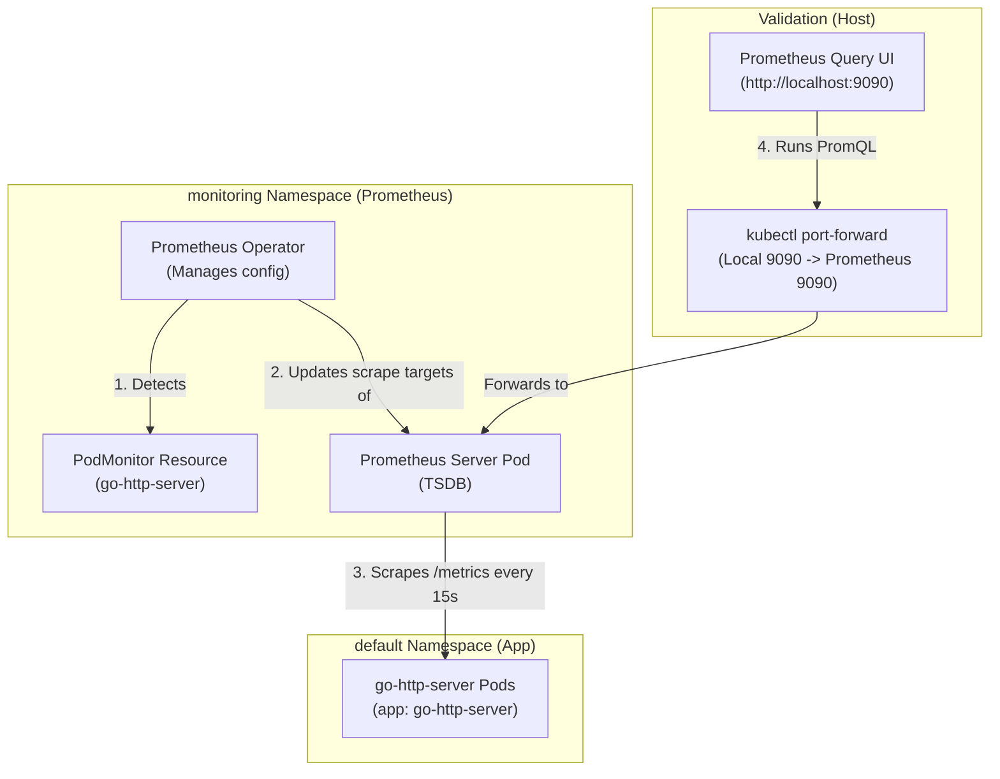
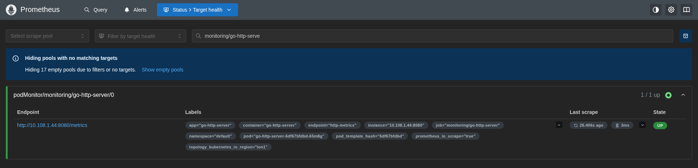
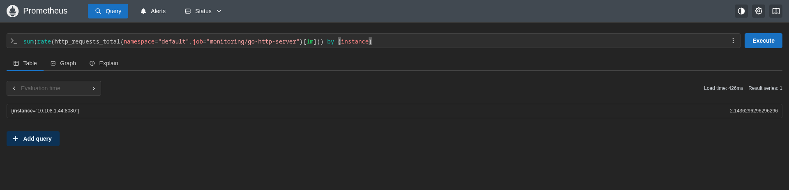

# Lab Exercise 3.2: Setting Up Prometheus in Kubernetes

In this exercise, we deploy the Prometheus Operator using Helm and configure a PodMonitor custom resource to scrape metrics from our instrumented Go HTTP application.

### 🌐 Prometheus Scrape & Discovery Flow



### 🛠️ Key Concepts & Design Decisions
1. **Prometheus Operator Pattern**:
   - Instead of manually editing giant configuration configmaps (`prometheus.yml`) and restarting Prometheus, we use the Kubernetes Operator pattern. We define a declarative Custom Resource (CRD) called `PodMonitor`, and the Prometheus Operator automatically translates it into active Prometheus scraping configurations.
2. **PodMonitor Label Matching**:
   - For Prometheus to pick up the `PodMonitor`, it must have a label matching the Prometheus deployment's service monitor selector. We use the label `release: prometheus-stack` to align with the default installation values.
3. **Scrape Relabeling**:
   - Using `action: labelmap` with a regex `__meta_kubernetes_pod_label_(.+)` copies Kubernetes pod metadata labels into the scraped timeseries as standard Prometheus labels (e.g. `app="go-http-server"`).

## Prerequisites

1. Kubernetes cluster with Metric Server installed as per Lab 1.
2. Completion of Lab Exercise 3.1.

## Lab Exercise

1. Install Prometheus Operator using Helm:
The Prometheus Operator provides Kubernetes native deployment and management of Prometheus and
related monitoring components. The setup is simplified by using Helm, a package manager for Kubernetes.
# Add the Prometheus Helm chart repository
```bash
helm repo add prometheus-community https://prometheus-community.github.io/helm-charts
```
# Update the repository
```bash
helm repo update
```
# Install the Prometheus stack
```bash
helm upgrade -i prometheus-stack prometheus-community/kube-prometheus-stack -n monitoring --create-namespace
```
2. Verify Prometheus pods are running in the cluster, using the command below:
```bash
kubectl get pods -n monitoring
```
```text
NAME                                                     READY   STATUS    RESTARTS   AGE
alertmanager-prometheus-stack-kube-prom-alertmanager-0   2/2     Running   0          5m
prometheus-prometheus-stack-kube-prom-prometheus-0       2/2     Running   0          5m
prometheus-stack-grafana-6c99cbfccb-8zc7r                3/3     Running   0          5m
prometheus-stack-kube-prom-operator-7dfbbf8df-qtvjk      1/1     Running   0          5m
prometheus-stack-kube-state-metrics-556d4c4c5d-wwjzk     1/1     Running   0          5m
prometheus-stack-prometheus-node-exporter-xnzgk          1/1     Running   0          5m
```
3. Configure Prometheus to monitor the sample application:
To allow Prometheus to discover and scrape metrics from your sample application, you need to define a
PodMonitor resource. This resource specifies how Prometheus should find and scrape targets.
Here's a breakdown of the functionality of each part of the PodMonitor resource:
- `spec`:
  - `selector.matchLabels`: A map of key-value pairs used for selecting the pods to monitor.
  Pods that have labels matching the matchLabels are monitored by this PodMonitor. Here, it's
  targeting pods with the label app: go-http-server.
  - `namespaceSelector.matchNames`: A list of namespace names where the pods to be
  monitored are located. This allows you to scope the PodMonitor to specific namespaces. Here,
  it's targeting pods in the default namespace.
  - `podMetricsEndpoints`: A list of endpoints (ports, paths, intervals, and additional
  configurations) on the selected pods where Prometheus can scrape metrics.
  - `port`: The name of the port in the pod's container where the metrics endpoint is
  exposed. Here, it's http-metrics.
  - `interval`: The interval at which Prometheus scrapes metrics from this endpoint, set to
  15s.
  - `path`: The HTTP path to scrape for metrics, here set to /metrics.
  - `relabelings`: A list of relabel_configs to apply to samples before scraping, allowing for
  fine-grained control over metrics labeling. The labelmap action creates labels from the
  discovered metadata. In this case, it converts Kubernetes labels into Prometheus labels.
Create pod-monitor.yaml file with the contents below:
```yaml
apiVersion: monitoring.coreos.com/v1
kind: PodMonitor
metadata:
  name: go-http-server
  namespace: monitoring # Namespace where Prometheus Operator is installed
  labels:
    release: prometheus-stack # Adjust to match the label of your Prometheus instance
spec:
  selector:
    matchLabels:
      app: go-http-server
  namespaceSelector:
    matchNames:
    - default # Namespace where the sample application is running
  podMetricsEndpoints:
  - port: http-metrics # Port name where the application exposes metrics
    interval: 15s
    path: /metrics
    relabelings:
    - action: labelmap
      regex: __meta_kubernetes_pod_label_(.+)
```
4. Apply the PodMonitor resource:
```bash
kubectl apply -f pod-monitor.yaml
```
5. Access Prometheus UI Locally:
To access the Prometheus UI locally, you can use kubectl port-forward to forward the Prometheus service port
to your local machine.
```bash
kubectl port-forward service/prometheus-stack-kube-prom-prometheus -n monitoring 9090:9090
```
Once the port forwarding is set up, you can access the Prometheus UI by navigating to http://localhost:9090 in
your web browser.
6. Testing: Verify Targets and Service Status:
In the Prometheus UI, click on Status (drop down) and select Targets. In this page you verify that your sample
application's endpoint is correctly discovered and scraped by Prometheus. Ensure the status of your
application's endpoint is 'up'.


7. Testing: Query Metrics in Prometheus UI:
To confirm that Prometheus is correctly collecting metrics from your sample application, use the Prometheus
query interface. Enter the following query and execute it:
```promql
sum(rate(http_requests_total{namespace="default",job="monitoring/go-http-server"}[1m])) by (instance)
```


This query calculates the rate of HTTP requests per second for the past minute for each instance of the
monitoring/go-http-server job in the default namespace, and then sums these rates up, presenting a
total rate per instance. If your application is emitting metrics correctly, you should see the results in the
Prometheus UI.

## Summary

In this exercise, you installed the Prometheus Operator using Helm to provide native Kubernetes monitoring
capabilities. You then configured Prometheus to monitor your application by defining a PodMonitor resource,
ensuring it targets the correct pods and scrapes metrics from the specified endpoints. After setting up port
forwarding to access Prometheus locally, you verified the monitoring setup by checking the Targets page in the
Prometheus UI, ensuring your application is being correctly discovered and scraped. You also tested the
collection of custom metrics by running a Prometheus query, validating that Prometheus is successfully
aggregating the rate of HTTP requests per second.