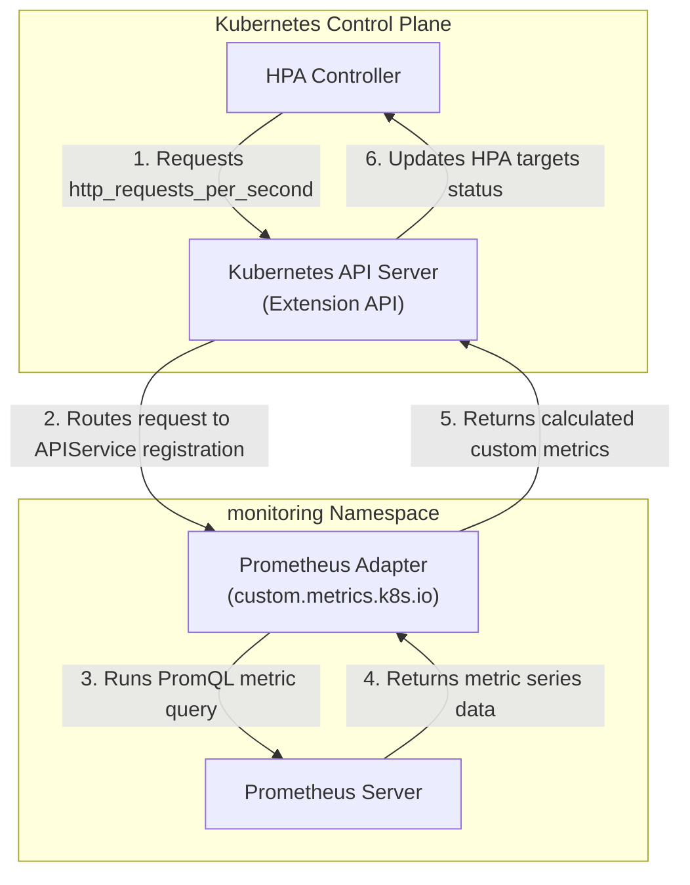

# Lab Exercise 3.3: Installing and Configuring the Prometheus Adapter

In this exercise, we install and configure the Prometheus Adapter to translate raw Prometheus time-series metrics into custom metrics and expose them via the Kubernetes Extension API Server.

### 🌐 Prometheus Adapter Translation Architecture



### 🛠️ Key Concepts & Configuration Rules
1. **Extension API Registration**:
   - The Prometheus Adapter registers an `APIService` resource targeting `v1beta1.custom.metrics.k8s.io`. This registers the adapter as the delegated handler for any requests received by the main Kubernetes API Server matching that path.
2. **Translation Rule Mechanics (`prometheus-adapter.yaml`)**:
   - **`seriesQuery`**: Tells the adapter which Prometheus metrics to process (e.g. `http_requests_total`).
   - **`resources.overrides`**: Tells the adapter how to map Prometheus labels (like `namespace` and `pod`) back to Kubernetes object resources.
   - **`metricsQuery`**: The PromQL template used by the adapter to fetch the metrics. The adapter automatically replaces the `<<.LabelMatchers>>` and `<<.GroupBy>>` placeholders depending on the resource query from the HPA (e.g., computing `sum(rate(http_requests_total{pod="go-http-server-xxx"}[1m])) by (pod)`).

## Prerequisites

1. Kubernetes cluster with Metric Server installed as per Lab 1.
2. Completion of Lab Exercises 3.1 and 3.2.

## Lab Ex1. Configure the Prometheus Adapter:
Before installing the Prometheus Adapter, we need to configure it to correctly connect to your Prometheus
instance and define how custom metrics are queried and exposed. Please create
`prometheus-adapter.yaml` file with the following contents:
```yaml
# Prometheus Adapter Configuration (prometheus-adapter.yaml):
prometheus:
  url: http://prometheus-stack-kube-prom-prometheus.monitoring.svc.cluster.local
  port: 9090
rules:
  default: false
  custom:
  - seriesQuery: 'http_requests_total{namespace="default",job="monitoring/go-http-server"}'
    resources:
      # This section maps Kubernetes resources to Prometheus labels
      overrides:
        namespace: {resource: "namespace"}
        pod: {resource: "pod"}
    name:
      # Naming the custom metric
      as: "http_requests_per_second"
    metricsQuery: 'sum(rate(http_requests_total{<<.LabelMatchers>>}[1m])) by (<<.GroupBy>>)'
```

Prometheus Connection Details:
- `prometheus.url`: Specifies the URL of the Prometheus server from which the Prometheus Adapter
will fetch metrics. Here, it's pointing to the Prometheus instance deployed within the monitoring
namespace.
- `prometheus.port`: Defines the port on which the Prometheus server is exposed, 9090 in this case.
Rules Configuration:
- `rules.default`: Indicates whether to use default rules. It's set to false, meaning you're providing
custom rules for the Prometheus Adapter.
- `rules.custom`: This is a list of custom rules that define how Prometheus metrics are translated into
custom metrics for Kubernetes.
- Custom Rules Breakdown:
  - `seriesQuery`: Defines a Prometheus query to select the time series to be converted into a
  custom metric. Here, `http_requests_total{namespace="default",job="monitoring/go-http-server"}` selects the `http_requests_total` metric from the `monitoring/go-http-server` job in the default namespace.
  - `resources.overrides`: Maps Kubernetes resource labels to Prometheus labels. It helps the
  Prometheus Adapter understand which Kubernetes resources (like namespaces or pods) are
  associated with which Prometheus metrics.
    - `namespace: {resource: "namespace"}`: Maps the namespace label in Prometheus to the namespace resource in Kubernetes.
    - `pod: {resource: "pod"}`: Maps the pod label in Prometheus to the pod resource in Kubernetes.
  - `name.as`: Defines the name of the custom metric that will be used in Kubernetes. Here, the
  metric is named `http_requests_per_second`.
  - `metricsQuery`: The actual query executed against the Prometheus server to fetch and
  aggregate metrics data. `sum(rate(requests_total{<<.LabelMatchers>>}[1m])) by (<<.GroupBy>>)`, calculates the sum of the rate of the `http_requests_total` metric over a 1-minute window, grouped by the labels specified in the `<<.GroupBy>>` placeholder.
  The `<<.LabelMatchers>>` and `<<.GroupBy>>` placeholders are dynamically replaced by the
  actual label matchers and grouping labels based on the Kubernetes resource to which the
  metric is attached, and the configuration provided in `resources.overrides`.
2. Install the Prometheus Adapter:
Install the Prometheus Adapter using Helm by providing the configuration file you prepared in the previous
step.
```bash
# Feel free to skip these first two steps when done previously in exercise 3.2
helm repo add prometheus-community https://prometheus-community.github.io/helm-charts
helm repo update
```
# Install the Prometheus Adapter
```bash
helm upgrade -i prometheus-adapter prometheus-community/prometheus-adapter -n monitoring --create-namespace --values prometheus-adapter.yaml
```
3. Verify Prometheus Adapter pods are running in the cluster, using the command below:
```bash
kubectl get deployments prometheus-adapter -n monitoring
```
```text
NAME                 READY   UP-TO-DATE   AVAILABLE   AGE
prometheus-adapter   1/1     1            1           28h
```
4. Testing: Verify custom metrics exposure:
To verify that the Prometheus Adapter is correctly exposing the custom metrics, you can query the custom
metrics API endpoint. This will show you the metrics that the HPA can use for scaling.
Note: If you encounter Command 'jq' not found, please install by executing: `sudo apt install jq`
```bash
kubectl get --raw "/apis/custom.metrics.k8s.io/v1beta1/namespaces/default/pods/*/http_requests_per_second?labelSelector=app=go-http-server" | jq
```
```json
{
  "kind": "MetricValueList",
  "apiVersion": "custom.metrics.k8s.io/v1beta1",
  "metadata": {},
  "items": [
    {
      "describedObject": {
        "kind": "Pod",
        "namespace": "default",
        "name": "go-http-server-67b955d8df-qjt6t",
        "apiVersion": "/v1"
      },
      "metricName": "http_requests_per_second",
      "timestamp": "2024-01-28T08:53:01Z",
      "value": "0",
      "selector": null
    }
  ]
```
The expected output should show the http_requests_per_second metric for each pod that matches the
label selector. If you see the metrics in the output, it means the Prometheus Adapter is correctly configured and
exposing custom metrics.

## Summary

In this exercise you configured and installed the Prometheus Adapter that links Prometheus metrics with
Kubernetes autoscaling capabilities. The adapter was configured to fetch metrics from a Prometheus instance
and expose them as custom metrics for Kubernetes.
After installing the Prometheus Adapter, its functionality was verified by querying the custom metrics API
endpoint. The successful retrieval of http_requests_per_second metrics for the selected pods confirmed
that the Prometheus Adapter was correctly configured and actively exposing the required metrics for
autoscaling purposes.