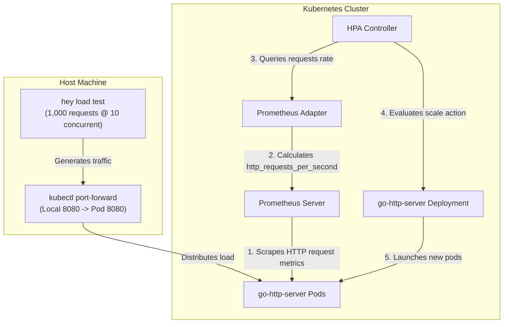
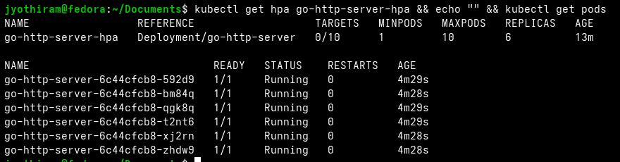

# Lab Exercise 3.4 Testing Autoscaling with Custom Metrics


# Lab Exercise 3.4: Testing Autoscaling with Custom Metrics

In this exercise, we configure a Horizontal Pod Autoscaler (HPA) to dynamically scale our Go HTTP application replicas based on the rate of incoming HTTP requests per second, measured using custom Prometheus metrics.

### 🌐 Custom Metrics Scaling Flow



### 🛠️ Key Concepts & Design Decisions
1. **Autoscaling Metric Target**:
   - We target a metric value of `10` requests per second per pod (`http_requests_per_second`). If the aggregate incoming traffic divided by the replica count exceeds 10, the HPA controller scales up the number of replicas (up to a maximum of 10).
2. **Metrics Resolution Delay**:
   - Unlike CPU utilization which is populated instantly by kubelet, custom metrics have a propagation delay:
     $$\text{Latency} = \text{App Scrape Interval (15s)} + \text{PromQL Rate window (1m)} + \text{Adapter cache update interval (30s)}$$
     This latency must be accounted for during load testing.

## Prerequisites

1. Kubernetes cluster with Metric Server installed as per Lab 1.
2. Completion of Lab Exercises 3.1, 3.2 and 3.3.

## Lab Exercise

1. Create an HPA Resource:
Create a Horizontal Pod Autoscaler (HPA) resource (in hpa.yaml file) that targets your application
deployment. The HPA will use the http_requests_per_second custom metric to make scaling decisions.
```yaml
apiVersion: autoscaling/v2
kind: HorizontalPodAutoscaler
metadata:
name: go-http-server-hpa
namespace: default
spec:
scaleTargetRef:
apiVersion: apps/v1
kind: Deployment
name: go-http-server
minReplicas: 1
maxReplicas: 10
metrics:
- type: Pods
pods:
metric:

name: http_requests_per_second
target:
type: AverageValue
averageValue: 10
```
2. Apply the HPA to your cluster:
```bash
kubectl apply -f hpa.yaml
```
3. Set up port forwarding to access the application.
```bash
kubectl port-forward deployment/go-http-server 8080:8080
```
```text
Forwarding from 127.0.0.1:8080 -> 8080
Forwarding from [::1]:8080 -> 8080
```
4. Generate load on the application:
Use the hey tool to generate load on your application. This will simulate traffic and cause the
http_requests_per_second metric to increase.
```bash
hey -n 10000 -c 1000 "http://localhost:8080/?number=30"
```
This command sends a total of 10,000 HTTP requests to http://localhost:8080/?number=30 using
1000 concurrent workers.
5. Monitor HPA behavior:
Observe the HPA behavior using the following command. As the load increases, the HPA should start scaling
the number of pods based on the http_requests_per_second metric.
```bash
kubectl get hpa go-http-server-hpa --watch
```
NAME REFERENCE TARGETS MINPODS MAXPODS
REPLICAS AGE
go-http-server-hpa Deployment/go-http-server 0/10 1 10
1 6h18m
Keep an eye on the REPLICAS column. Initially, the replica count should be 1. As the
http_requests_per_second metric increases and surpasses the target value (10 in our case), the HPA
should scale up the number of replicas.
Once the load generation by hey stops, observe if the HPA scales the number of replicas back to the minimum
(1 in this case) after the cool-down period.
In case the HPA does not scale replicas to the minimum after some period of time, you have probably hit this
Kubernetes issue.



6. Clean up
```bash
kubectl delete hpa/go-http-server-hpa deploy/go-http-server
```
service/go-http-server

## Troubleshooting

- Too many opened sockets: If you encounter a similar error, make sure you have increased the limit of
maximum opened files. For the active session this should be ulimit -n 10000.
- Scaling not happening: Check the status resource of the HPA for details. For instance, if you didn’t
delete the HPA from Exercise 2, that has the same label selector, and it will not work.

## Summary

In this exercise, we configured a Horizontal Pod Autoscaler (HPA) to monitor http_requests_per_second
custom metric and automatically scale the go-http-server deployment. We also generated load on the
application using the hey tool to test the HPA's responsiveness to increased traffic. Next, we monitored the
behavior of the HPA under load, observing the increase in pod replicas as the http_requests_per_second
metric surpassed the target value. Finally, we evaluated the HPA's ability to scale down after load reduction,
ensuring efficient resource utilization and responsiveness to traffic changes.