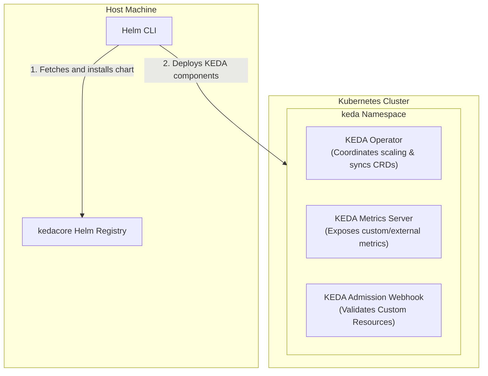

# Lab Exercise 5.1: Install KEDA Using Helm Chart

In this exercise, we install KEDA (Kubernetes-based Event-Driven Autoscaling) via Helm and explore its internal architectural deployments.

### 🌐 KEDA Core Architecture



### 🛠️ Key Components & Responsibilities
1. **KEDA Operator**: 
   - Acts as the primary agent responsible for activating and deactivating deployments (scaling to and from zero). It creates and manages Kubernetes Horizontal Pod Autoscaler (HPA) resources under the hood to handle standard scaling.
2. **KEDA Metrics Server**:
   - Integrates into the Kubernetes API registration system to provide custom and external metrics (e.g. queue lengths, database query counts, CPU loads) from third-party event sources directly to the HPA controller.
3. **KEDA Admission Webhook**:
   - Intercepts creation and modification requests of KEDA custom resources (like `ScaledObjects` and `TriggerAuthentications`) to validate configurations, ensuring semantic correctness before they are saved to etcd.

## Prerequisites

Kubernetes cluster with Metric Server installed as per Lab 1.

## Lab Exercise

1. Install Keda Using Helm:
Execute the following commands, to get started:
```bash
helm repo add kedacore https://kedacore.github.io/charts
helm repo update
helm upgrade -i keda kedacore/keda --namespace keda --create-namespace
```
2. Verify KEDA pods are running in the cluster, using the command below:
```bash
kubectl get deployment -n keda
```
```text
NAME                               READY   UP-TO-DATE   AVAILABLE   AGE
keda-admission-webhooks            1/1     1            1           13m
keda-operator                      1/1     1            1           13m
keda-operator-metrics-apiserver   1/1     1            1           13m
```
3. (Optional) Register your own CA in KEDA Operator Trusted Store.
There are use cases where we need to use self-signed CAs (cases like AWS where their CA isn’t registered as
trusted, etc.). Some scalers allow skipping the cert validation by setting the unsafeSsl parameter, but this isn’t
ideal because it allows any certificate, which is not secure. To overcome this problem, KEDA supports
registering custom CAs to be used by SDKs where possible. To register custom CAs, you need to ensure that
the certs are in the /custom/ca folder mounted in the KEDA Operator pod. KEDA will try to register as trusted
CAs, all certificates inside this folder.
a. Create required CA & TLS certificates pairs. The commands below are used to generate SSL/TLS
certificates for a Kubernetes service.
```bash
openssl genrsa -out ca.key 2048
openssl req -x509 -new -nodes -key ca.key -subj "/CN=example-ca" -days 3650 -out ca.crt
```
```bash
openssl genrsa -out tls.key 2048
openssl req -new -key tls.key -subj "/CN=keda-service" -out tls.csr
openssl x509 -req -in tls.csr -CA ca.crt -CAkey ca.key -CAcreateserial -out tls.crt -days 365 -extfile <(printf "subjectAltName=DNS:keda-service,DNS:localhost")
```
```bash
rm tls.csr
```
Here is a summary of what each command does:
- openssl genrsa -out ca.key 2048
Generates a private key for the Certificate Authority (CA) with a key length of 2048 bits and saves it to a
file named "ca.key".
- openssl req -x509 -new -nodes -key ca.key -subj "/CN=example-ca" -days 3650
-out ca.crt
Generates a self-signed X.509 certificate for the CA using the private key generated in the previous
step. The certificate is valid for 3650 days and is saved to a file named "ca.crt".
- openssl genrsa -out tls.key 2048
Generates a private key for the TLS certificate with a key length of 2048 bits and saves it to a file
named "tls.key".
- openssl req -new -key tls.key -subj "/CN=keda-service" -out tls.csr
Generates a Certificate Signing Request (CSR) for the TLS certificate using the private key generated
in the previous step. The CSR is saved to a file named "tls.csr".
- openssl x509 -req -in tls.csr -CA ca.crt -CAkey ca.key -CAcreateserial -out
tls.crt -days 365 -extfile <(printf
"subjectAltName=DNS:keda-service,DNS:localhost")
Generates an X.509 certificate for the TLS certificate using the CSR and the CA certificate and private
key generated earlier. The certificate is valid for 365 days and is saved to a file named "tls.crt". The
`subjectAltName` extension is added to the certificate with the DNS names "keda-service" and
"localhost". This extension is used to specify additional domain names (subject alternative names) for
the certificate, which is useful when the certificate is used for a Kubernetes service that can be
accessed using multiple domain names.
b. Remove the original Kubernetes secret kedaorg-certs
This secret contains certificates that KEDA uses, we will replace these with our custom certificates.
```bash
kubectl delete secret kedaorg-certs -n keda
```
c. Create a new Kubernetes secret.
Use the certificates generated above to create a Kubernetes secret called kedaorg-certs, this secret is
used by KEDA deployment to load certificates.
```bash
kubectl create secret generic kedaorg-certs -n keda \
  --from-file=ca.crt=./ca.crt \
  --from-file=ca.key=./ca.key \
  --from-file=tls.crt=./tls.crt \
  --from-file=tls.key=./tls.key
```
d. Install KEDA by disabling certificate generation. This step depends on how KEDA is being installed. For
Helm, execute the following command:
```bash
helm upgrade -i keda kedacore/keda --namespace keda --create-namespace --set=certificates.autoGenerated=false
```
e. Verify KEDA pods are running in the cluster using the command below:
```bash
kubectl get deployment -n keda
```
3. (Optional) Uninstall KEDA
If you wish to try different installation methods, uninstall KEDA installed via Helm first.
```bash
helm uninstall keda -n keda
```

## Summary

Let’s review the steps we completed in this exercise:
- Installed KEDA using the Helm chart by adding the KEDA Helm repository and then installing KEDA in
the specified namespace.
- Verified that the KEDA pods are running in the cluster to ensure a successful installation.
- Optionally, registered a custom CA in the KEDA Operator Trusted Store to support self-signed CAs and
improve security.
- Created the required CA and TLS certificate pairs using OpenSSL commands.
- Created a Kubernetes secret using the generated certificates to be used by the KEDA deployment.
- Installed KEDA by disabling certificate generation to use the custom certificates.