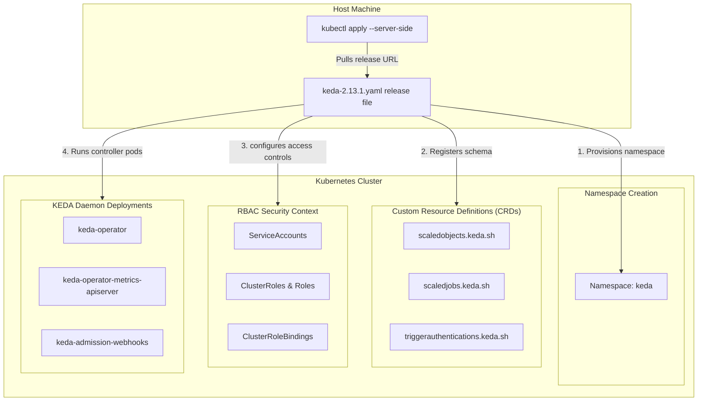

# Lab Exercise 5.3: Install KEDA Using YAML Files

In this exercise, we install KEDA directly using the consolidated release manifest YAML files published on GitHub, which applies the entire namespace, CRD definitions, cluster-role-bindings, and daemon deployments in a single step.

### 🌐 Direct YAML Manifest Installation Flow



### 🛠️ Key Concepts & Design Decisions
1. **Server-Side Apply (`--server-side`)**:
   - We use Kubernetes Server-Side Apply. This allows the API server to merge modifications cleanly and track field ownership, bypassing potential errors caused by large manifest sizes exceeding the `kubectl.kubernetes.io/last-applied-configuration` annotation limit.
2. **Cluster RBAC Permissions**:
   - Installing KEDA requires cluster-admin privileges because it registers cluster-wide resources: Custom Resource Definitions (CRDs), ClusterRoles, ClusterRoleBindings, and an `APIService` (under `apiregistration.k8s.io`) that routes external metric requests.
3. **No-Template Manual Tweaking**:
   - Installing via static YAML file means there are no templates (like Helm values). Any tuning (e.g. changing request limits, setting timeouts, adjusting cert-rotation flags) must be done by editing the live deployments using `kubectl edit` or patching manifests directly.

## Prerequisites

Kubernetes cluster with Metric Server installed as per Lab 1.

## Lab Exercise

1. Apply YAML Files
```bash
kubectl apply --server-side --force-conflicts -f https://github.com/kedacore/keda/releases/download/v2.13.1/keda-2.13.1.yaml
```
namespace/keda serverside-applied
customresourcedefinition.apiextensions.k8s.io/cloudeventsources.eventing.keda.sh
serverside-applied
customresourcedefinition.apiextensions.k8s.io/clustertriggerauthentications.keda.
sh serverside-applied
customresourcedefinition.apiextensions.k8s.io/scaledjobs.keda.sh
serverside-applied
customresourcedefinition.apiextensions.k8s.io/scaledobjects.keda.sh
serverside-applied
customresourcedefinition.apiextensions.k8s.io/triggerauthentications.keda.sh
serverside-applied
serviceaccount/keda-operator serverside-applied
role.rbac.authorization.k8s.io/keda-operator serverside-applied
clusterrole.rbac.authorization.k8s.io/keda-external-metrics-reader
serverside-applied
clusterrole.rbac.authorization.k8s.io/keda-operator serverside-applied
rolebinding.rbac.authorization.k8s.io/keda-operator serverside-applied
rolebinding.rbac.authorization.k8s.io/keda-auth-reader serverside-applied
clusterrolebinding.rbac.authorization.k8s.io/keda-hpa-controller-external-metrics
serverside-applied
clusterrolebinding.rbac.authorization.k8s.io/keda-operator serverside-applied
clusterrolebinding.rbac.authorization.k8s.io/keda-system-auth-delegator
serverside-applied
service/keda-admission-webhooks serverside-applied
service/keda-metrics-apiserver serverside-applied
service/keda-operator serverside-applied
deployment.apps/keda-admission serverside-applied
deployment.apps/keda-metrics-apiserver serverside-applied
deployment.apps/keda-operator serverside-applied
apiservice.apiregistration.k8s.io/v1beta1.external.metrics.k8s.io
serverside-applied
validatingwebhookconfiguration.admissionregistration.k8s.io/keda-admission
serverside-applied
2. Verify KEDA pods are running in the cluster using the command below:
```bash
kubectl get deployment -n keda
```
NAME READY UP-TO-DATE AVAILABLE AGE
keda-admission-webhooks 1/1 1 1 5m
keda-operator 1/1 1 1 5m
keda-operator-metrics-apiserver 1/1 1 1 5m
3. Modifying KEDA configuration:
For modifying any KEDA configuration, such as KEDA_HTTP_DEFAULT_TIMEOUT, changing replicas and
command line flags, you can directly edit the above Kubernetes deployments using
```bash
kubectl edit command
```
4. (Optional) Register your own CA in KEDA Operator Trusted Store.
For configuring, custom CA & TLS certificates refer to Lab 5.1, Lab Exercise instruction
number 3.
Once the certificates and secrets are created, use the kubectl edit deployment keda-operator -n
keda command and set the --enable-cert-rotation flag to false, which is by default true.
Also restart the other deployments using the command below:
```bash
kubectl rollout restart deployment keda-admission-webhooks
kubectl rollout restart deployment keda-operator-metrics-apiserver
```
5. (Optional) Uninstall KEDA
If you wish to try different installation methods, uninstall KEDA installed via YAML files first.
```bash
kubectl delete -f https://github.com/kedacore/keda/releases/download/v2.13.1/keda-2.13.1.yaml
```

## Summary

Now that you have successfully installed KEDA using YAML files, you are ready to verify the installation, which
we will do in the next exercise.