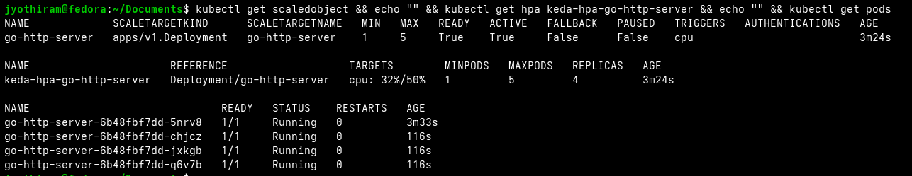

# Lab Exercise 5.4: Post Install Verification

In this exercise, we verify our KEDA installation by deploying a custom resource (`ScaledObject`) targeting our CPU-intensive Go HTTP application and validating that KEDA correctly provisions and synchronizes a Kubernetes Horizontal Pod Autoscaler (HPA) to scale the pods.

### 🌐 KEDA ScaledObject Integration Flow

```mermaid
graph TD
    subgraph K8sUser["User Space"]
        SO["ScaledObject Resource<br/>(Target: go-http-server, CPU: 50%)"]
    end

    subgraph KedaCore["KEDA System Namespace"]
        SO -->|1. Watched & Validated by| Operator["KEDA Operator"]
        Operator -->|2. Generates & Syncs| AutoHPA["Auto-generated HPA<br/>(keda-hpa-go-http-server)"]
    end

    subgraph AppNamespace["Application Namespace"]
        Deploy["go-http-server Deployment"]
        Pods["go-http-server Pods"]
        MS["Metrics Server"]
        
        MS -.->|3. Collects CPU usage| Pods
        AutoHPA -->|4. Queries utilization| MS
        AutoHPA -->|5. Computes desired replicas| Deploy
        Deploy -->|6. Scales replicas (1 to 5)| Pods
    end

    style SO fill:#e8f5e9,stroke:#43a047
    style AutoHPA fill:#fff3e0,stroke:#ffb74d
```

### 🛠️ Key Concepts & Design Decisions
1. **ScaledObject CRD (Custom Resource Definition)**:
   - KEDA introduces the `ScaledObject` resource to declaratively define how Kubernetes deployments should be autoscaled. You define the target workload (`scaleTargetRef`), minimum/maximum replicas, and triggering rules.
2. **Dynamic HPA Generation**:
   - The KEDA Operator does not implement autoscaling algorithms itself. Instead, it reads the `ScaledObject`, generates a native Kubernetes HPA resource, and delegates the real-time resource-based scaling (e.g. CPU or Memory) to the built-in Kubernetes HPA controller.
3. **Trigger Types (CPU)**:
   - We specify the trigger `type: cpu` with target utilization `50`. KEDA hooks this up to resource metric collection. Under the hood, this uses standard Kubernetes resource metrics rather than external event scaling.

## Prerequisites

1. Kubernetes cluster with Metric Server installed as per Lab 1.
2. The application that was created in Lab 3.
3. KEDA installed as per Lab 5.1, 5.2 or 5.3.

## Lab Exercise

1. Create Sample Application. We will reuse the application created in Lab 3.
Create deployment.yaml file with the contents below. This file defines a Kubernetes deployment for your
Sample Application. Be sure to replace the image field with the respective image name you created in
Lab 3.
```yaml
apiVersion: apps/v1
kind: Deployment
metadata:
name: go-http-server
spec:
selector:
matchLabels:
app: go-http-server
template:
metadata:
labels:
app: go-http-server
prometheus.io/scrape: "true"
spec:
containers:
- name: go-http-server

imagePullPolicy: IfNotPresent
image: <username>/go-http-server:lab-03
ports:
- containerPort: 8080
name: http-metrics
resources:
requests:
cpu: "25m"
limits:
cpu: "50m"
---
apiVersion: v1
kind: Service
metadata:
name: go-http-server
spec:
selector:
app: go-http-server
ports:
- protocol: TCP
port: 8080
targetPort: 8080
```
2. Deploy Sample Application:
```bash
kubectl apply -f deployment.yaml
```
3. Verify deployed application.
```bash
kubectl get deployments -n default
```
NAME READY UP-TO-DATE AVAILABLE AGE
go-http-server 1/1 1 1 12s
4. Create ScaledObject:
Create scaledobject.yaml file with the contents below. This configuration creates a ScaledObject (a KEDA
CRD, more about it in the next chapter) resource that targets the "go-http-server" deployment and uses the
CPU utilization metric to make scaling decisions. The ScaledObject will scale the number of replicas between 1
and 5 based on the CPU utilization of the deployment. The value parameter in the triggers.metadata section
specifies the target CPU utilization value for the deployment
```yaml
apiVersion: keda.sh/v1alpha1
kind: ScaledObject
metadata:
name: go-http-server

namespace: default
spec:
scaleTargetRef:
apiVersion: apps/v1
kind: Deployment
name: go-http-server
minReplicaCount: 1
maxReplicaCount: 5
triggers:
- type: cpu
metricType: Utilization
metadata:
value: "50"
```
5. Apply ScaledObject:
```bash
kubectl apply -f scaledobject.yaml
```
6. Set up port forwarding to access the application.
```bash
kubectl port-forward deployment/go-http-server 8080:8080
```
```text
Forwarding from 127.0.0.1:8080 -> 8080
Forwarding from [::1]:8080 -> 8080
```
7. Generated load:
```bash
hey -n 1000 -c 100 http://localhost:8080/
```
8. Observe auto scaling behavior. Observe the HPA behavior using the command below. As the cpu load
increases, the HPA should start scaling the number of pods, indicated by the replicas column. Once load
generation stops, cpu load will start decreasing and HPA will start scaling down the replicas.
```bash
kubectl get hpa keda-hpa-go-http-server --watch
```
NAME REFERENCE TARGETS MINPODS MAXPODS
REPLICAS
keda-hpa-go-http-server Deployment/go-http-server 51%/50% 1 5
4



9. Clean up:
```bash
kubectl delete -f deployment.yaml
kubectl delete -f scaledobject.yaml
```

## Summary

In this exercise, we completed the following:
- Deployed the go-http-server application, which was containerized and tested in Lab 2.
- Defined a ScaledObject resource, a KEDA Custom Resource Definition (CRD), to manage the scaling
behavior of the go-http-server deployment based on CPU utilization. Configured the autoscaling
parameters, including the target CPU utilization and the minimum and maximum number of replicas.
- Used the hey tool to generate load on the application and monitored the scaling behavior using the
```bash
kubectl get hpa command. We verified that KEDA responds to increased CPU load by scaling the
```
number of pods within the defined limits.