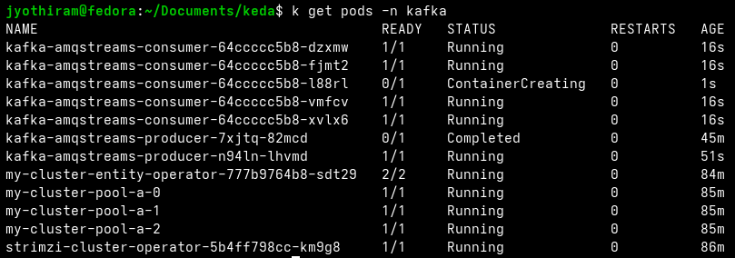

# Lab Exercise 6.2: Autoscale Based on Kafka Consumer Lag

In this exercise, we will auto scale the consumer application on the basis of Kafka Consumer Lag (which measures the delay between message production and consumption) by setting up a KEDA `ScaledObject` that uses the Apache Kafka trigger.

## Prerequisites

1. Basic understanding of Kubernetes and KEDA.
2. Familiarity with Kafka.
3. Access to a Kubernetes environment with KEDA and Metric Server installed as per Lab 5.
4. Completion of Lab Exercise 6.1.

## Lab Exercise

1. Create ScaledObject:
The `ScaledObject` (a KEDA CRD) below tells KEDA to monitor a Kafka topic (`my-topic`) and scale the deployment (`kafka-amqstreams-consumer`) based on the consumer lag. If the lag goes above 1, KEDA will start to scale out the deployment, until it reaches a maximum of 5 replicas. It scales down when the lag is less than 1. Here are some important configurations:
* **scaleTargetRef**:
  * **name**: `kafka-amqstreams-consumer`: This refers to the target resource (usually a Kubernetes Deployment, ReplicaSet, etc.) that KEDA will scale. In this case, it's `kafka-amqstreams-consumer`.
* **triggers**: This section defines the events or metrics that should trigger scaling actions.
  * **type**: `apache-kafka`: This indicates that the trigger is based on Apache Kafka metrics.
  * **metadata**: Contains specific data for the Kafka trigger:
    1. **topic**: `my-topic`: The Kafka topic to monitor.
    2. **bootstrapServers**: `my-cluster-kafka-bootstrap.kafka.svc:9092`: The address of the Kafka cluster to connect to.
    3. **consumerGroup**: `my-group`: The Kafka consumer group that is consuming the topic.
    4. **lagThreshold**: `"1"`: The lag threshold for scaling. If the lag exceeds this number, KEDA will start to scale out the application.
    5. **offsetResetPolicy**: `"latest"`: Determines what offsets to use when the consumer group finds no initial offset in Kafka or if the current offset no longer exists on the server.

Create a file named `scaledobject.yaml` with the following contents and apply it using the command below.
```yaml
apiVersion: keda.sh/v1alpha1
kind: ScaledObject
metadata:
  name: kafka-amqstreams-consumer-scaledobject
  namespace: kafka
spec:
  minReplicaCount: 0
  maxReplicaCount: 5
  scaleTargetRef:
    name: kafka-amqstreams-consumer
  triggers:
  - type: apache-kafka
    metadata:
      topic: my-topic
      bootstrapServers: my-cluster-kafka-bootstrap.kafka.svc:9092
      consumerGroup: my-group
      lagThreshold: "1"
      offsetResetPolicy: "latest"
```
```bash
kubectl apply -f scaledobject.yaml
```

2. Scale to zero.
Once you apply the scaled object, you will observe that the deployment is scaled to zero, as there are no messages in the queue.
```bash
kubectl get deployment kafka-amqstreams-consumer -n kafka
```
```text
NAME                        READY   UP-TO-DATE   AVAILABLE   AGE
kafka-amqstreams-consumer   0/0     0            0           41h
```

3. Generate messages using producer:
As done in the previous exercise, execute the same command to produce Kafka messages. But this time, set the `MESSAGE_COUNT` value to 3000.
```bash
sed 's/value: "20"/value: "3000"/' ../13_Kafka_Cluster_Setup/producer.yaml | kubectl create -f -
```

4. Monitor auto scaling behavior:
Execute the command below to monitor the auto scaling behavior of the consumer application.
```bash
kubectl get hpa keda-hpa-kafka-amqstreams-consumer-scaledobject -n kafka --watch
```
```text
NAME                                              REFERENCE                              TARGETS             MINPODS   MAXPODS   REPLICAS   AGE
keda-hpa-kafka-amqstreams-consumer-scaledobject   Deployment/kafka-amqstreams-consumer   <unknown>/1 (avg)   1         5         0          40s
keda-hpa-kafka-amqstreams-consumer-scaledobject   Deployment/kafka-amqstreams-consumer   <unknown>/1 (avg)   1         5         0          60s
keda-hpa-kafka-amqstreams-consumer-scaledobject   Deployment/kafka-amqstreams-consumer   2/1 (avg)           1         5         1          2m
keda-hpa-kafka-amqstreams-consumer-scaledobject   Deployment/kafka-amqstreams-consumer   2500m/1 (avg)       1         5         2          3m
keda-hpa-kafka-amqstreams-consumer-scaledobject   Deployment/kafka-amqstreams-consumer   1250m/1 (avg)       1         5         4          4m
keda-hpa-kafka-amqstreams-consumer-scaledobject   Deployment/kafka-amqstreams-consumer   0/1 (avg)           1         5         5          5m
keda-hpa-kafka-amqstreams-consumer-scaledobject   Deployment/kafka-amqstreams-consumer   <unknown>/1 (avg)   1         5         0          9m
```



Below is the breakdown of the autoscaling events:
* **Initial Observation (Age: 40s - 60s)**:
  * **State**: The metrics are being retrieved by KEDA.
  * **Targets**: The metric showing `<unknown>/1 (avg)` indicates that the consumer lag metric is not yet available or has not been reported.
  * **Replicas**: The count is 0, suggesting the HPA hasn't initiated scaling up yet.
* **Scaling From Zero**:
  * **State**: KEDA detects the consumer lag is greater than 0 (messages are present in the queue). In response, KEDA scales the consumer application from 0 to 1 replica. Further scaling is then managed by the HPA.
* **First Scale Out (Age: 2m)**:
  * **Targets**: The metric `2/1 (avg)` signifies that the consumer lag has increased to 2, exceeding the target threshold of 1.
  * **Replicas**: Scaled up to 2 replicas as KEDA responds to the lag increase.
* **Second Scale Out (Age: 3m)**:
  * **Targets**: `2500m/1 (avg)` (which corresponds to an average lag of 2.5) indicates a further significant increase in consumer lag.
  * **Replicas**: Scaled up to 4 replicas to distribute the load.
* **Maximum Scale Out (Age: 4m)**:
  * **Targets**: `1250m/1 (avg)` shows the consumer lag is still above the target of 1.
  * **Replicas**: Reached the configured maximum count of 5 replicas (`MAXPODS`).
* **Stabilization Period (Age: 5m)**:
  * **Targets**: `0/1 (avg)` suggests that the consumer lag has decreased to 0 (all messages have been successfully processed).
  * **Replicas**: Maintained at 5, indicating a period of stabilization before scaling down.
* **Scaling In (Age: 9m)**:
  * **Targets**: The metric `<unknown>/1 (avg)` or `0/1 (avg)` stabilizes.
  * **Replicas**: The replica count is scaled back to 0. This delayed scale-in occurs after the default `cooldownPeriod` of 5 minutes (300 seconds), ensuring that the system doesn't scale down prematurely and allows for a buffer to ascertain that the low load is stable.

## Summary

In this exercise, we configured KEDA `ScaledObject` to automatically scale the `kafka-amqstreams-consumer` deployment based on Kafka consumer lag, scaling between 0 and 5 replicas as the lag crosses the threshold of 1. We also observed and verified the autoscaling behavior of the consumer application in response to varying Kafka consumer lag, demonstrating KEDA's ability to dynamically scale out to handle high lag and scale in to zero when lag is minimal.