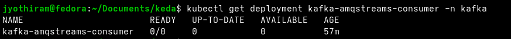
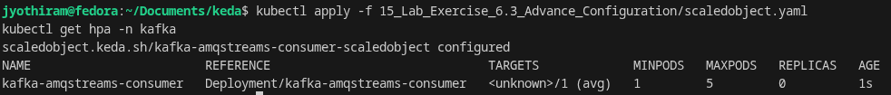
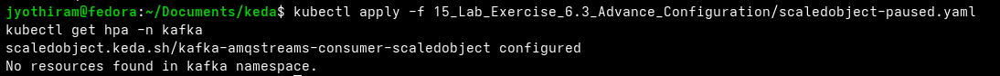

# Lab Exercise 6.3: Advance Configuration

In this exercise, we will explore advanced KEDA `ScaledObject` configurations. You will learn how to customize the Horizontal Pod Autoscaler (HPA), manage scaling activities during various operational states, and fine-tune performance parameters. Through hands-on tasks, we will observe the effects of renaming the HPA, pausing scaling, adjusting cooldown periods, and managing idle replicas on the dynamic scaling behavior of a Kafka consumer application.

## Prerequisites

1. Basic understanding of Kubernetes and KEDA.
2. Familiarity with Kafka.
3. Access to a Kubernetes environment with KEDA and Metric Server installed as per Lab 5.
4. Completion of Lab Exercises 6.1 and 6.2.

## Lab Exercise

### 1. Renaming the HPA
By default, when you create a `ScaledObject`, KEDA creates and manages a corresponding HPA resource named `keda-hpa-{scaled-object-name}`. KEDA allows you to customize the HPA resource name using the `advanced` configuration in the `ScaledObject` specification.

Create a file named `scaledobject.yaml` with the following content:
```yaml
apiVersion: keda.sh/v1alpha1
kind: ScaledObject
metadata:
  name: kafka-amqstreams-consumer-scaledobject
  namespace: kafka
spec:
  minReplicaCount: 1
  maxReplicaCount: 5
  scaleTargetRef:
    name: kafka-amqstreams-consumer
  triggers:
  - type: apache-kafka
    metadata:
      topic: my-topic
      bootstrapServers: my-cluster-kafka-bootstrap.kafka.svc:9092
      consumerGroup: my-group
      lagThreshold: "1"
      offsetResetPolicy: "latest"
  advanced:
    horizontalPodAutoscalerConfig:
      name: kafka-amqstreams-consumer
```

Apply the configuration:
```bash
kubectl apply -f scaledobject.yaml
```

Once applied, the HPA resource `keda-hpa-kafka-amqstreams-consumer-scaledobject` is renamed to `kafka-amqstreams-consumer`. Verify the renaming:
```bash
kubectl get hpa -n kafka
```
```text
NAME                        REFERENCE                              TARGETS             MINPODS   MAXPODS   REPLICAS   AGE
kafka-amqstreams-consumer   Deployment/kafka-amqstreams-consumer   <unknown>/1 (avg)   1         5         0          7s
```



---

### 2. Pause Scaling
You can instruct KEDA to pause autoscaling of objects during cluster maintenance or to avoid resource starvation by removing non-mission-critical workloads. This is done by adding the `autoscaling.keda.sh/paused: "true"` annotation to the `ScaledObject`.

Create a file named `scaledobject-paused.yaml` with the following content:
```yaml
apiVersion: keda.sh/v1alpha1
kind: ScaledObject
metadata:
  name: kafka-amqstreams-consumer-scaledobject
  namespace: kafka
  annotations:
    autoscaling.keda.sh/paused: "true"
spec:
  minReplicaCount: 1
  maxReplicaCount: 5
  scaleTargetRef:
    name: kafka-amqstreams-consumer
  triggers:
  - type: apache-kafka
    metadata:
      topic: my-topic
      bootstrapServers: my-cluster-kafka-bootstrap.kafka.svc:9092
      consumerGroup: my-group
      lagThreshold: "1"
      offsetResetPolicy: "latest"
```

Apply the paused configuration:
```bash
kubectl apply -f scaledobject-paused.yaml
```

When autoscaling is paused, KEDA deletes the HPA resource managed for this deployment. Verify that the HPA has been deleted:
```bash
kubectl get hpa keda-hpa-kafka-amqstreams-consumer-scaledobject -n kafka
```
```text
Error from server (NotFound): horizontalpodautoscalers.autoscaling "keda-hpa-kafka-amqstreams-consumer-scaledobject" not found
```



---

### 3. Modify and Observe Cooldown Periods
The `cooldownPeriod` specifies how long KEDA should wait before scaling down to zero after the last active trigger becomes inactive. (Note: KEDA's `cooldownPeriod` only applies when scaling to/from zero).

Create a file named `scaled-object-cooldown-period.yaml` with the following content:
```yaml
apiVersion: keda.sh/v1alpha1
kind: ScaledObject
metadata:
  name: kafka-amqstreams-consumer-scaledobject
  namespace: kafka
spec:
  minReplicaCount: 1
  maxReplicaCount: 5
  cooldownPeriod: 60
  scaleTargetRef:
    name: kafka-amqstreams-consumer
  triggers:
  - type: apache-kafka
    metadata:
      topic: my-topic
      bootstrapServers: my-cluster-kafka-bootstrap.kafka.svc:9092
      consumerGroup: my-group
      lagThreshold: "1"
      offsetResetPolicy: "latest"
```

Apply the configuration:
```bash
kubectl apply -f scaled-object-cooldown-period.yaml
```

Generate Kafka messages using the producer job:
```bash
sed 's/value: "20"/value: "3000"/' ../13_Lab_Exercise_6.1_Kafka_Cluster_Setup/producer.yaml | kubectl create -f -
```

Monitor the HPA and scaling events in separate terminals:
```bash
kubectl get hpa keda-hpa-kafka-amqstreams-consumer-scaledobject -n kafka --watch
```
```bash
kubectl get events -n kafka --watch --field-selector involvedObject.kind=HorizontalPodAutoscaler,involvedObject.name=keda-hpa-kafka-amqstreams-consumer-scaledobject
```

Example chronological event output:
```text
NAME                                              REFERENCE                              TARGETS             MINPODS   MAXPODS   REPLICAS   AGE
keda-hpa-kafka-amqstreams-consumer-scaledobject   Deployment/kafka-amqstreams-consumer   <unknown>/1 (avg)   1         5         0          5s
keda-hpa-kafka-amqstreams-consumer-scaledobject   Deployment/kafka-amqstreams-consumer   <unknown>/1 (avg)   1         5         0          47s
keda-hpa-kafka-amqstreams-consumer-scaledobject   Deployment/kafka-amqstreams-consumer   5/1 (avg)           1         5         1          5m47s
0s          Normal   SuccessfulRescale             horizontalpodautoscaler/keda-hpa-kafka-amqstreams-consumer-scaledobject   New size: 4; reason: external metric s0-kafka-my-topic above target
keda-hpa-kafka-amqstreams-consumer-scaledobject   Deployment/kafka-amqstreams-consumer   1250m/1 (avg)       1         5         4          6m47s
0s          Normal   SuccessfulRescale             horizontalpodautoscaler/keda-hpa-kafka-amqstreams-consumer-scaledobject   New size: 5; reason: external metric s0-kafka-my-topic above target
keda-hpa-kafka-amqstreams-consumer-scaledobject   Deployment/kafka-amqstreams-consumer   800m/1 (avg)        1         5         5          7m47s
keda-hpa-kafka-amqstreams-consumer-scaledobject   Deployment/kafka-amqstreams-consumer   0/1 (avg)           1         5         5          8m47s
keda-hpa-kafka-amqstreams-consumer-scaledobject   Deployment/kafka-amqstreams-consumer   0/1 (avg)           1         5         5          11m
0s          Normal   SuccessfulRescale             horizontalpodautoscaler/keda-hpa-kafka-amqstreams-consumer-scaledobject   New size: 4; reason: All metrics below target
keda-hpa-kafka-amqstreams-consumer-scaledobject   Deployment/kafka-amqstreams-consumer   0/1 (avg)           1         5         4          12m
0s          Normal   SuccessfulRescale             horizontalpodautoscaler/keda-hpa-kafka-amqstreams-consumer-scaledobject   New size: 1; reason: All metrics below target
keda-hpa-kafka-amqstreams-consumer-scaledobject   Deployment/kafka-amqstreams-consumer   0/1 (avg)           1         5         1          13m
keda-hpa-kafka-amqstreams-consumer-scaledobject   Deployment/kafka-amqstreams-consumer   <unknown>/1 (avg)   1         5         0          24m
```

---

### 4. Managing Idle Replicas
The `idleReplicaCount` parameter specifies the number of replicas that should run when there is no workload. This allows the system to scale down to `idleReplicaCount` (e.g., `0`) when inactive, but scale up to `minReplicaCount` (e.g., `1`) as soon as there is any activity.

Create a file named `scaled-object-ideal-replica-count.yaml` with the following content:
```yaml
apiVersion: keda.sh/v1alpha1
kind: ScaledObject
metadata:
  name: kafka-amqstreams-consumer-scaledobject
  namespace: kafka
spec:
  minReplicaCount: 1
  maxReplicaCount: 5
  idleReplicaCount: 0
  scaleTargetRef:
    name: kafka-amqstreams-consumer
  triggers:
  - type: apache-kafka
    metadata:
      topic: my-topic
      bootstrapServers: my-cluster-kafka-bootstrap.kafka.svc:9092
      consumerGroup: my-group
      lagThreshold: "1"
      offsetResetPolicy: "latest"
```

Apply the configuration:
```bash
kubectl apply -f scaled-object-ideal-replica-count.yaml
```

Generate messages again using the producer:
```bash
sed 's/value: "20"/value: "3000"/' ../13_Lab_Exercise_6.1_Kafka_Cluster_Setup/producer.yaml | kubectl create -f -
```

Monitor HPA and event scaling logs:
```bash
kubectl get hpa keda-hpa-kafka-amqstreams-consumer-scaledobject -n kafka --watch
```
```bash
kubectl get events -n kafka --watch --field-selector involvedObject.kind=HorizontalPodAutoscaler,involvedObject.name=keda-hpa-kafka-amqstreams-consumer-scaledobject
```

Example chronological event output:
```text
NAME                                              REFERENCE                              TARGETS             MINPODS   MAXPODS   REPLICAS   AGE
keda-hpa-kafka-amqstreams-consumer-scaledobject   Deployment/kafka-amqstreams-consumer   <unknown>/1 (avg)   1         5         0          14s
keda-hpa-kafka-amqstreams-consumer-scaledobject   Deployment/kafka-amqstreams-consumer   <unknown>/1 (avg)   1         5         0          60s
0s          Normal   SuccessfulRescale             horizontalpodautoscaler/keda-hpa-kafka-amqstreams-consumer-scaledobject   New size: 1; reason: Current number of replicas below Spec.MinReplicas
keda-hpa-kafka-amqstreams-consumer-scaledobject   Deployment/kafka-amqstreams-consumer   1500m/1 (avg)       1         5         1          2m
0s          Normal   SuccessfulRescale             horizontalpodautoscaler/keda-hpa-kafka-amqstreams-consumer-scaledobject   New size: 3; reason: external metric s0-kafka-my-topic above target
keda-hpa-kafka-amqstreams-consumer-scaledobject   Deployment/kafka-amqstreams-consumer   1667m/1 (avg)       1         5         3          3m1s
1s          Normal   SuccessfulRescale             horizontalpodautoscaler/keda-hpa-kafka-amqstreams-consumer-scaledobject   New size: 5; reason: external metric s0-kafka-my-topic above target
keda-hpa-kafka-amqstreams-consumer-scaledobject   Deployment/kafka-amqstreams-consumer   0/1 (avg)           1         5         5          4m1s
0s          Normal   SuccessfulRescale             horizontalpodautoscaler/keda-hpa-kafka-amqstreams-consumer-scaledobject   New size: 2; reason: All metrics below target
keda-hpa-kafka-amqstreams-consumer-scaledobject   Deployment/kafka-amqstreams-consumer   0/1 (avg)           1         5         2          8m1s
keda-hpa-kafka-amqstreams-consumer-scaledobject   Deployment/kafka-amqstreams-consumer   0/1 (avg)           1         5         1          9m1s
keda-hpa-kafka-amqstreams-consumer-scaledobject   Deployment/kafka-amqstreams-consumer   <unknown>/1 (avg)   1         5         0          13m
```



Here:
* At `60s`, when metrics were unknown, replicas remained at `0` (matching `idleReplicaCount`).
* When lag appeared, KEDA immediately scaled to the minimum active replica count of `1` (at the `2m` mark).
* When demand ceased, HPA scaled back to `1` replica (at the `9m` mark).
* Finally, KEDA deactivated scaling and returned the replica count to `idleReplicaCount: 0`.

## Summary

This exercise demonstrated various advanced configurations that KEDA offers for dealing with nuanced autoscaling use cases, such as pausing autoscaling, configuring the underlying HPA from KEDA ScaledObject CRD, working with idleReplicas, and cooldown Period.

## Clean Up

```bash
kubectl delete scaledobjects.keda.sh -n kafka kafka-amqstreams-consumer-scaledobject
kubectl delete deployments.apps -n kafka kafka-amqstreams-consumer
kubectl delete kafka -n kafka my-cluster
kubectl delete namespace kafka
```