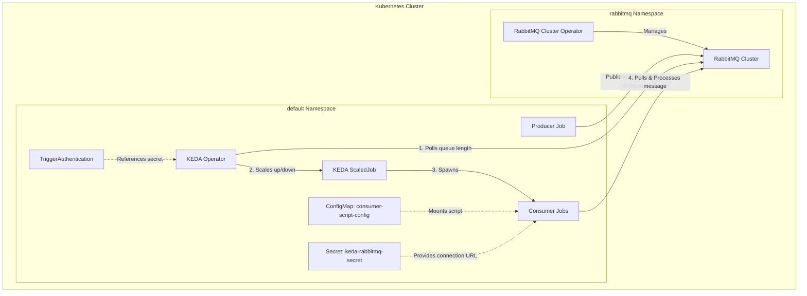

# Lab Exercise 7.1: Configuring ScaledJobs for RabbitMQ

This exercise introduces the configuration and deployment of **ScaledJobs** using **KEDA** to dynamically manage batch workloads in response to messages in a RabbitMQ queue. You will create a `ScaledJob` resource that instructs KEDA to automatically scale job instances based on the volume of messages, showcasing a practical implementation of event-driven autoscaling for run-to-completion workloads in Kubernetes.

## 🏗️ Architecture



---

## Prerequisites

1. Basic understanding of Kubernetes and KEDA.
2. Familiarity with RabbitMQ concepts.
3. Access to a Kubernetes environment with KEDA installed.

---

## Lab Environment Setup

We will install the RabbitMQ cluster in Kubernetes using the official RabbitMQ Cluster Operator.

### 1. Install Operator
Use the following command to deploy the RabbitMQ Cluster Operator:
```bash
kubectl apply -f https://github.com/rabbitmq/cluster-operator/releases/latest/download/cluster-operator.yml
```

### 2. Verify Operator
Wait until the operator pod is in the `Running` state:
```bash
kubectl get pods -n rabbitmq-system
```
*Expected Output:*
```text
NAME                                         READY   STATUS    RESTARTS   AGE
rabbitmq-cluster-operator-ccf488f4c-nqrwn    1/1     Running   0          18s
```

### 3. Create a RabbitMQ Cluster
Create a file named `rabbitmq_cluster.yaml` with the contents below:
```yaml
apiVersion: v1
kind: Namespace
metadata:
  name: rabbitmq
---
apiVersion: v1
kind: Secret
metadata:
  name: my-secret
  namespace: rabbitmq
type: Opaque
data:
  default_user.conf: ZGVmYXVsdF91c2VyID0gZGVmYXVsdF91c2VyX2htR1pGaGRld3E2NVA0ZElkeDcKZGVmYXVsdF9wYXNzID0gcWM5OG40aUdEN01ZWE1CVkZjSU8ybXRCNXZvRHVWX24K
  password: cWM5OG40aUdEN01ZWE1CVkZjSU8ybXRCNXZvRHVWX24=
  username: ZGVmYXVsdF91c2VyX2htR1pGaGRld3E2NVA0ZElkeDc=
---
apiVersion: rabbitmq.com/v1beta1
kind: RabbitmqCluster
metadata:
  name: rabbitmq-cluster
  namespace: rabbitmq
spec:
  secretBackend:
    externalSecret:
      name: "my-secret"
```

Apply the manifest using:
```bash
kubectl apply -f rabbitmq_cluster.yaml
```

### 4. Verify the Cluster
Wait until the RabbitMQ cluster pod is fully `Running` and `Ready`:
```bash
kubectl get pods -n rabbitmq
```
*Expected Output:*
```text
NAME                        READY   STATUS    RESTARTS   AGE
rabbitmq-cluster-server-0   1/1     Running   0          63s
```

---

## Lab Exercise

### 1. Create a Secret for RabbitMQ Credentials
This secret stores the RabbitMQ connection URL containing the username, password, and the cluster service endpoint.

Create a file named `rabbitmq-creds-secret.yaml`:
```yaml
apiVersion: v1
kind: Secret
metadata:
  name: keda-rabbitmq-secret
type: Opaque
data:
  host: YW1xcDovL2RlZmF1bHRfdXNlcl9obUdaRmhkZXdxNjVQNGRJZHg3OnFjOThuNGlHRDdNWVhNQlZGY0lPMm10QjV2b0R1Vl9uQHJhYmJpdG1xLWNsdXN0ZXIucmFiYml0bXEuc3ZjLmNsdXN0ZXIubG9jYWw6NTY3Mg==
```

Apply the secret:
```bash
kubectl apply -f rabbitmq-creds-secret.yaml
```

### 2. Create a ConfigMap for the Consumer Script
We will store the consumer bash script in a ConfigMap. This script uses the `amqp-consume` CLI to fetch messages from the queue. For each message processed, it simulates a video-encoding task by sleeping for 360 seconds before executing a POST request to record completion.

Create a file named `rabbitmq-consumer-script.yaml`:
```yaml
apiVersion: v1
kind: ConfigMap
metadata:
  name: consumer-script-config
data:
  consumer-script.sh: |
    #!/bin/bash
    currentMessage=""
    handle_sigterm() {
      if [ -n "$currentMessage" ]; then
        echo "SIGTERM signal received while processing a message."
        curl -X POST http://result-analyzer-service:8080/kill/count -s
        echo "Kill count HTTP request sent."
      else
        echo "SIGTERM signal received, but no message was being processed."
      fi
      exit 0
    }
    trap 'handle_sigterm' SIGTERM
    echo -e "Waiting for message...\n"
    if ! currentMessage=$(amqp-consume --url="$RABBITMQ_URL" -q "testqueue" -c 1 cat); then
      echo -e "Error occurred during message consumption. Exiting...\n"
      exit 1
    fi
    echo -e "Message received, processing: $currentMessage \n"
    i=1
    while [ $i -le 360 ]; do
      echo "Encoding video $i"
      sleep 1
      i=$((i+1))
    done
    currentMessage=""
    curl -X POST http://result-analyzer-service:8080/create/count -s
    echo -e "Waiting for next message...\n"
```

Apply the ConfigMap:
```bash
kubectl apply -f rabbitmq-consumer-script.yaml
```

### 3. Deploy the Producer Job
The producer application creates a RabbitMQ queue named `testqueue` and publishes 15 messages (as defined by `MESSAGE_COUNT`).

Create a file named `rabbitmq-producer.yaml`:
```yaml
apiVersion: batch/v1
kind: Job
metadata:
  generateName: producer-program-
spec:
  template:
    metadata:
      labels:
        app: producer-program
    spec:
      restartPolicy: Never
      containers:
      - name: producer-program
        image: ghcr.io/kedify/blog05-python-producer-program:latest
        env:
        - name: MESSAGE_COUNT
          value: "15"
        - name: RABBITMQ_URL
          valueFrom:
            secretKeyRef:
              name: keda-rabbitmq-secret
              key: host
```

Run the producer job:
```bash
kubectl create -f rabbitmq-producer.yaml
```

### 4. Create the ScaledJob
The following manifest establishes a `TriggerAuthentication` referencing the connection secret, and a KEDA `ScaledJob` that monitors the queue length of `testqueue` to spawn matching processing jobs (up to `maxReplicaCount: 100`).

Create a file named `scaled-job.yaml`:
```yaml
apiVersion: keda.sh/v1alpha1
kind: TriggerAuthentication
metadata:
  name: keda-trigger-auth-rabbitmq-conn
  namespace: default
spec:
  secretTargetRef:
  - parameter: host
    name: keda-rabbitmq-secret
    key: host
---
apiVersion: keda.sh/v1alpha1
kind: ScaledJob
metadata:
  name: rabbitmq-scaledjob
  namespace: default
spec:
  jobTargetRef:
    template:
      spec:
        containers:
        - name: consumer-program
          image: ghcr.io/kedify/blog05-cli-consumer-program:latest
          command: ["/bin/bash"]
          args: ["/scripts/consumer-script.sh"]
          volumeMounts:
          - name: script-volume
            mountPath: /scripts
          env:
          - name: RABBITMQ_URL
            valueFrom:
              secretKeyRef:
                name: keda-rabbitmq-secret
                key: host
        volumes:
        - name: script-volume
          configMap:
            name: consumer-script-config
        restartPolicy: Never
  pollingInterval: 10 # How often KEDA will check the RabbitMQ queue
  successfulJobsHistoryLimit: 100 # Number of successful jobs to keep
  failedJobsHistoryLimit: 100 # Number of failed jobs to keep
  maxReplicaCount: 100 # Maximum number of jobs that KEDA can create
  triggers:
  - type: rabbitmq
    metadata:
      protocol: amqp
      queueName: testqueue
      mode: QueueLength
      value: "1" # Number of messages per job
    authenticationRef:
      name: keda-trigger-auth-rabbitmq-conn
```

Deploy the ScaledJob:
```bash
kubectl apply -f scaled-job.yaml
```

### 5. Monitor scaling behavior
Unlike standard deployments, a KEDA `ScaledJob` manages run-to-completion Kubernetes `Job` objects directly without relying on an HPA. Since we published 15 messages, KEDA will scale the job count up to 15 concurrent pods.

Run the monitoring command:
```bash
kubectl get pods -l=scaledjob.keda.sh/name=rabbitmq-scaledjob
```
*Expected Output:*
```text
NAME                             READY   STATUS    RESTARTS   AGE
rabbitmq-scaledjob-7nw9k-dhcs9   1/1     Running   0          25s
rabbitmq-scaledjob-dt8tr-52mkv   1/1     Running   0          26s
rabbitmq-scaledjob-gnxb9-ggz6n   1/1     Running   0          27s
...
```

To see details about the active job executions:
```bash
kubectl get jobs -l=scaledjob.keda.sh/name=rabbitmq-scaledjob
```

### 6. Clean up
Remove all active jobs from the namespace once the simulation completes:
```bash
kubectl delete jobs --all --wait
```

---

## Summary

In this exercise, you successfully set up a **ScaledJob** in KEDA to process messages from a RabbitMQ queue. You created Kubernetes secrets for RabbitMQ credentials, a ConfigMap hosting the consumer script, and a Python producer job to populate the queue. Finally, you deployed the ScaledJob which triggered KEDA to dynamically orchestrate and scale job instances based on message lag, showcasing an efficient scaling pattern for resource-sensitive batch processing.