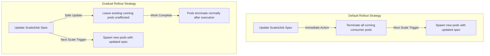

# Lab Exercise 7.2: Implementing Different Rollout Strategies

This exercise explores how KEDA manages updates to `ScaledJob` resources and the impact of different rollout strategies on running jobs. 

You will first observe KEDA's **default rollout strategy**, which immediately terminates all active/running pods when a `ScaledJob` configuration is modified. Then, you will transition to implementing the **gradual rollout strategy**, which allows active workloads to complete their execution before applying the updated configuration to newly spawned pods, minimizing disruption to your background processes.

---

## 🏗️ Rollout Strategy Behaviors



---

## Prerequisites

1. Basic understanding of Kubernetes and KEDA.
2. Completion of **Lab Exercise 7.1** (RabbitMQ Cluster and Secrets already deployed).

---

## Lab Exercise

### 1. Observing the Default Strategy
By default, any update to a `ScaledJob` spec causes KEDA to recreate the underlying controller, resulting in the immediate termination of all active pods.

1. Generate 15 messages in the RabbitMQ queue using the producer job:
   ```bash
   kubectl create -f rabbitmq-producer.yaml
   ```

2. Wait a few seconds and verify that KEDA spawns 15 consumer pods in the `Running` state:
   ```bash
   kubectl get pods
   ```

3. Open a separate terminal or run a watch command to monitor the pods:
   ```bash
   watch "kubectl get pods -l scaledjob.keda.sh/name=rabbitmq-scaledjob"
   ```

4. Modify `maxReplicaCount` in `scaled-job.yaml` from `100` to `50`:
   ```yaml
   maxReplicaCount: 50
   ```

5. Apply the update:
   ```bash
   kubectl apply -f scaled-job.yaml
   ```

6. Observe the terminal output. You will see that all running consumer pods are immediately sent a termination signal:
   ```text
   NAME                             READY   STATUS        RESTARTS   AGE
   rabbitmq-scaledjob-2bnpg-x2jzd   0/1     Completed     0          30s
   rabbitmq-scaledjob-47t29-g65tf   1/1     Terminating   0          30s
   rabbitmq-scaledjob-bnzl2-tfxqf   1/1     Terminating   0          30s
   ```

---

### 2. Implementing the Gradual Strategy
To prevent active worker pods from terminating abruptly when the ScaledJob configuration changes, you can configure the `gradual` rollout strategy.

1. Create a file named `scaled-job-gradual-rollout.yaml` and add `rollout.strategy: gradual` to the spec:
   ```yaml
   apiVersion: keda.sh/v1alpha1
   kind: TriggerAuthentication
   metadata:
     name: keda-trigger-auth-rabbitmq-conn
     namespace: default
   spec:
     secretTargetRef:
     - parameter: host
       name: keda-rabbitmq-secret
       key: host
   ---
   apiVersion: keda.sh/v1alpha1
   kind: ScaledJob
   metadata:
     name: rabbitmq-scaledjob
     namespace: default
   spec:
     rollout:
       strategy: gradual
     jobTargetRef:
       template:
         spec:
           containers:
           - name: consumer-program
             image: ghcr.io/kedify/blog05-cli-consumer-program:latest
             command: ["/bin/bash"]
             args: ["/scripts/consumer-script.sh"]
             volumeMounts:
             - name: script-volume
               mountPath: /scripts
             env:
             - name: RABBITMQ_URL
               valueFrom:
                 secretKeyRef:
                   name: keda-rabbitmq-secret
                   key: host
           volumes:
           - name: script-volume
             configMap:
               name: consumer-script-config
           restartPolicy: Never
     pollingInterval: 10
     successfulJobsHistoryLimit: 100
     failedJobsHistoryLimit: 100
     maxReplicaCount: 50
     triggers:
     - type: rabbitmq
       metadata:
         protocol: amqp
         queueName: testqueue
         mode: QueueLength
         value: "1"
       authenticationRef:
         name: keda-trigger-auth-rabbitmq-conn
   ```

2. Clean up any existing active jobs first:
   ```bash
   kubectl delete jobs --all --wait
   ```

3. Apply the gradual rollout ScaledJob configuration:
   ```bash
   kubectl apply -f scaled-job-gradual-rollout.yaml
   ```

---

### 3. Observing the Gradual Rollout Strategy

1. Publish another batch of 15 messages:
   ```bash
   kubectl create -f rabbitmq-producer.yaml
   ```

2. Wait until the consumer pods are in the `Running` state:
   ```bash
   kubectl get pods
   ```

3. Modify `maxReplicaCount` in `scaled-job-gradual-rollout.yaml` from `50` to `70` and apply it:
   ```bash
   kubectl apply -f scaled-job-gradual-rollout.yaml
   ```

4. Check your pods list:
   ```bash
   kubectl get pods
   ```
   *Observe that unlike the default strategy, no active pods are terminated. They continue running safely until they complete their work.*

---

## Summary

In this exercise, you demonstrated the implementation of different rollout strategies for ScaledJob resources managed by KEDA:
- **Default Strategy**: Immediately terminates all active pods when a ScaledJob configuration change is applied.
- **Gradual Strategy**: Allows active worker pods to execute to completion without disruption. Newly spawned pods will consume the updated configuration.