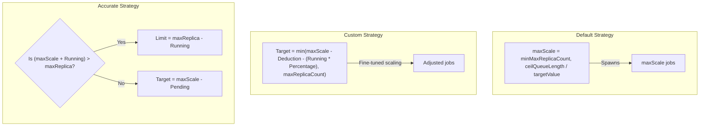

# Lab Exercise 7.3: Testing Scaling Strategies

This exercise introduces the configuration and deployment of KEDA **Scaling Strategies** (Default, Custom, and Accurate) for `ScaledJob` resources. You will learn how KEDA calculates the target number of worker pods during each polling interval and observe KEDA's scaling decisions dynamically in response to RabbitMQ metrics.

---

## 🏗️ Scaling Strategies Comparison



---

## Prerequisites

1. Basic understanding of Kubernetes and KEDA.
2. Completion of **Lab Exercises 7.1 and 7.2** (RabbitMQ Cluster and Secrets already deployed).

---

## Lab Exercise

### 1. Implementing the Custom Strategy
The Custom strategy provides precise control over scaling rates to prevent resource starvation or overwhelming the infrastructure by deducting a configured value and taking active running jobs into account.

1. Create a file named `scaled-job-custom-scaling.yaml` with the contents below:
   ```yaml
   apiVersion: keda.sh/v1alpha1
   kind: TriggerAuthentication
   metadata:
     name: keda-trigger-auth-rabbitmq-conn
     namespace: default
   spec:
     secretTargetRef:
     - parameter: host
       name: keda-rabbitmq-secret
       key: host
   ---
   apiVersion: keda.sh/v1alpha1
   kind: ScaledJob
   metadata:
     name: rabbitmq-scaledjob
     namespace: default
   spec:
     jobTargetRef:
       template:
         spec:
           containers:
           - name: consumer-program
             image: ghcr.io/kedify/blog05-cli-consumer-program:latest
             command: ["/bin/bash"]
             args: ["/scripts/consumer-script.sh"]
             volumeMounts:
             - name: script-volume
               mountPath: /scripts
             env:
             - name: RABBITMQ_URL
               valueFrom:
                 secretKeyRef:
                   name: keda-rabbitmq-secret
                   key: host
           volumes:
           - name: script-volume
             configMap:
               name: consumer-script-config
           restartPolicy: Never
     pollingInterval: 10
     successfulJobsHistoryLimit: 100
     failedJobsHistoryLimit: 100
     maxReplicaCount: 100
     scalingStrategy:
       strategy: "custom"
       customScalingQueueLengthDeduction: 1
       customScalingRunningJobPercentage: "0.5"
     triggers:
     - type: rabbitmq
       metadata:
         protocol: amqp
         queueName: testqueue
         mode: QueueLength
         value: "1"
       authenticationRef:
         name: keda-trigger-auth-rabbitmq-conn
   ```

2. Apply the configuration:
   ```bash
   kubectl apply -f scaled-job-custom-scaling.yaml
   ```

3. Publish 20 messages to RabbitMQ by running:
   ```bash
   sed 's/value: "15"/value: "20"/' rabbitmq-producer.yaml | kubectl create -f -
   ```

4. Watch the pods scale:
   ```bash
   kubectl get pods -l scaledjob.keda.sh/name=rabbitmq-scaledjob
   ```
   *Note: Under Custom Scaling, KEDA calculates the first scale target using:*
   $$\text{Target} = \text{maxScale} - \text{Deduction} - (\text{Running} \times \text{Percentage}) = 20 - 1 - (0 \times 0.5) = 19 \text{ pods}$$

---

### 2. Implementing the Accurate Strategy
The Accurate strategy prevents KEDA from over-provisioning jobs by taking the number of currently pending jobs into account, ensuring that KEDA only spins up the exact number of jobs needed to satisfy the remaining queue lag.

1. Clean up the previous custom scaling resources:
   ```bash
   kubectl delete scaledjob rabbitmq-scaledjob && kubectl delete jobs --all --wait
   ```

2. Create a file named `scaled-job-accurate-scaling.yaml` with the scaling strategy set to `accurate`:
   ```yaml
   apiVersion: keda.sh/v1alpha1
   kind: TriggerAuthentication
   metadata:
     name: keda-trigger-auth-rabbitmq-conn
     namespace: default
   spec:
     secretTargetRef:
     - parameter: host
       name: keda-rabbitmq-secret
       key: host
   ---
   apiVersion: keda.sh/v1alpha1
   kind: ScaledJob
   metadata:
     name: rabbitmq-scaledjob
     namespace: default
   spec:
     jobTargetRef:
       template:
         spec:
           containers:
           - name: consumer-program
             image: ghcr.io/kedify/blog05-cli-consumer-program:latest
             command: ["/bin/bash"]
             args: ["/scripts/consumer-script.sh"]
             volumeMounts:
             - name: script-volume
               mountPath: /scripts
             env:
             - name: RABBITMQ_URL
               valueFrom:
                 secretKeyRef:
                   name: keda-rabbitmq-secret
                   key: host
           volumes:
           - name: script-volume
             configMap:
               name: consumer-script-config
           restartPolicy: Never
     pollingInterval: 10
     successfulJobsHistoryLimit: 100
     failedJobsHistoryLimit: 100
     maxReplicaCount: 100
     scalingStrategy:
       strategy: "accurate"
     triggers:
     - type: rabbitmq
       metadata:
         protocol: amqp
         queueName: testqueue
         mode: QueueLength
         value: "1"
       authenticationRef:
         name: keda-trigger-auth-rabbitmq-conn
   ```

3. Apply the accurate scaling configuration:
   ```bash
   kubectl apply -f scaled-job-accurate-scaling.yaml
   ```

4. Publish 20 messages to RabbitMQ:
   ```bash
   sed 's/value: "15"/value: "20"/' rabbitmq-producer.yaml | kubectl create -f -
   ```

5. Watch the pods scale:
   ```bash
   kubectl get pods -l scaledjob.keda.sh/name=rabbitmq-scaledjob
   ```
   *Note: Under Accurate Scaling, KEDA calculates the scale target using:*
   $$\text{Target} = \text{maxScale} - \text{pendingJobCount} = 20 - 0 = 20 \text{ pods}$$

---

## Clean Up

Remove all active jobs and scaling resources from the namespace once the simulation completes:
```bash
kubectl delete scaledjob rabbitmq-scaledjob
kubectl delete jobs --all --wait
```

---

## Summary

In this exercise, you explored KEDA's **Custom** and **Accurate** scaling strategies:
- **Custom Strategy**: Allows fine-tuning scaling targets by deducting queue lengths and running jobs using configured ratios.
- **Accurate Strategy**: Ensures exactly-once / target-accurate scaling decisions by subtracting pending jobs from the computed scale-up limit.