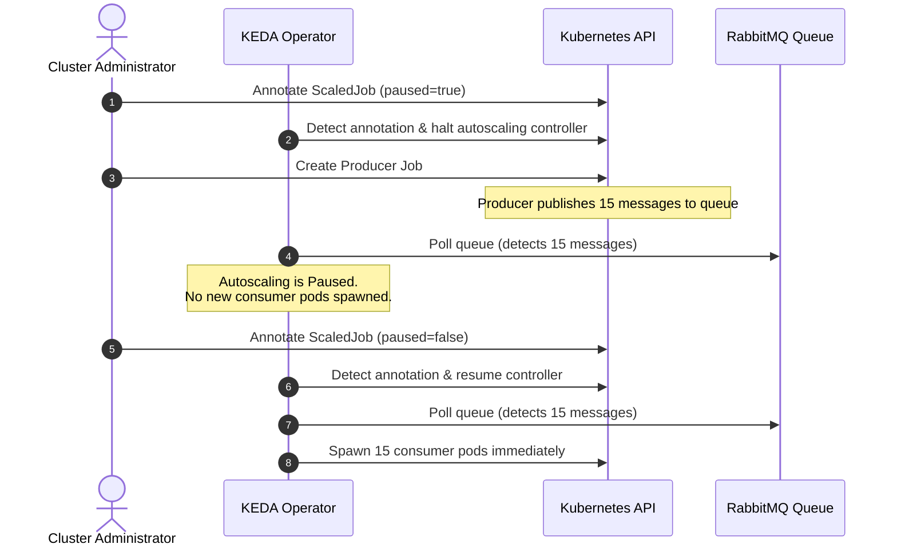
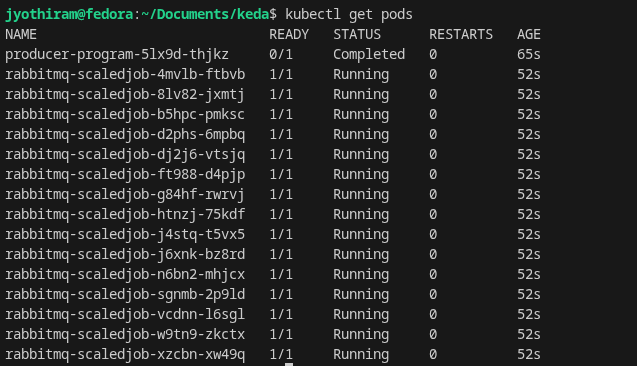

# Lab Exercise 7.4: Pausing and Resuming Scaling Operations

This exercise demonstrates how to pause and resume KEDA's autoscaling operations. Pausing autoscaling is highly useful when performing cluster maintenance, debugging issues, or preventing resource starvation by temporarily disabling non-critical workloads.

KEDA supports pausing scaling for both `ScaledObject` and `ScaledJob` using annotations:
- `autoscaling.keda.sh/paused: "true"`: Instantly pauses autoscaling at the current replica count.
- `autoscaling.keda.sh/paused-replicas: "<number>"`: Scales the workload to the specified number of replicas first, then pauses autoscaling.

---

## 🏗️ Autoscaling Pause & Resume Workflow



---

## 📂 Manifests

The following manifests are used in this exercise:

### 1. RabbitMQ Cluster (`rabbitmq_cluster.yaml`)
Deploys a RabbitMQ cluster in the `rabbitmq` namespace.
```yaml
apiVersion: v1
kind: Namespace
metadata:
  name: rabbitmq
---
apiVersion: v1
kind: Secret
metadata:
  name: my-secret
  namespace: rabbitmq
type: Opaque
data:
  default_user.conf: ZGVmYXVsdF91c2VyID0gZGVmYXVsdF91c2VyX2htR1pGaGRld3E2NVA0ZElkeDcKZGVmYXVsdF9wYXNzID0gcWM5OG40aUdEN01ZWE1CVkZjSU8ybXRCNXZvRHVWX24K
  password: cWM5OG40aUdEN01ZWE1CVkZjSU8ybXRCNXZvRHVWX24=
  username: ZGVmYXVsdF91c2VyX2htR1pGaGRld3E2NVA0ZElkeDc=
---
apiVersion: rabbitmq.com/v1beta1
kind: RabbitmqCluster
metadata:
  name: rabbitmq-cluster
  namespace: rabbitmq
spec:
  secretBackend:
    externalSecret:
      name: "my-secret"
```

### 2. Secret and ConfigMap (`rabbitmq-creds-secret.yaml` and `rabbitmq-consumer-script.yaml`)
Provide the connection details and the worker program.
```yaml
apiVersion: v1
kind: Secret
metadata:
  name: keda-rabbitmq-secret
type: Opaque
data:
  host: YW1xcDovL2RlZmF1bHRfdXNlcl9obUdaRmhkZXdxNjVQNGRJZHg3OnFjOThuNGlHRDdNWVhNQlZGY0lPMm10QjV2b0R1Vl9uQHJhYmJpdG1xLWNsdXN0ZXIucmFiYml0bXEuc3ZjLmNsdXN0ZXIubG9jYWw6NTY3Mg==
```

### 3. ScaledJob (`scaled-job.yaml`)
Defines the `ScaledJob` configured to autoscale based on the RabbitMQ queue length.
```yaml
apiVersion: keda.sh/v1alpha1
kind: TriggerAuthentication
metadata:
  name: keda-trigger-auth-rabbitmq-conn
  namespace: default
spec:
  secretTargetRef:
  - parameter: host
    name: keda-rabbitmq-secret
    key: host
---
apiVersion: keda.sh/v1alpha1
kind: ScaledJob
metadata:
  name: rabbitmq-scaledjob
  namespace: default
spec:
  jobTargetRef:
    template:
      spec:
        containers:
        - name: consumer-program
          image: ghcr.io/kedify/blog05-cli-consumer-program:latest
          command: ["/bin/bash"]
          args: ["/scripts/consumer-script.sh"]
          volumeMounts:
          - name: script-volume
            mountPath: /scripts
          env:
          - name: RABBITMQ_URL
            valueFrom:
              secretKeyRef:
                name: keda-rabbitmq-secret
                key: host
        volumes:
        - name: script-volume
          configMap:
            name: consumer-script-config
        restartPolicy: Never
  pollingInterval: 10
  successfulJobsHistoryLimit: 100
  failedJobsHistoryLimit: 100
  maxReplicaCount: 100
  triggers:
  - type: rabbitmq
    metadata:
      protocol: amqp
      queueName: testqueue
      mode: QueueLength
      value: "1"
    authenticationRef:
      name: keda-trigger-auth-rabbitmq-conn
```

### 4. Producer Job (`rabbitmq-producer.yaml`)
Used to publish 15 messages to the `testqueue` queue.
```yaml
apiVersion: batch/v1
kind: Job
metadata:
  generateName: producer-program-
spec:
  template:
    metadata:
      labels:
        app: producer-program
    spec:
      restartPolicy: Never
      containers:
      - name: producer-program
        image: ghcr.io/kedify/blog05-python-producer-program:latest
        env:
        - name: MESSAGE_COUNT
          value: "15"
        - name: RABBITMQ_URL
          valueFrom:
            secretKeyRef:
              name: keda-rabbitmq-secret
              key: host
```

---

## 🛠️ Step-by-Step Lab Walkthrough

### 1. Pausing Autoscaling
We apply the annotation to pause autoscaling *before* generating queue messages to see how KEDA behaves.

1. Ensure the ScaledJob is deployed:
   ```bash
   kubectl apply -f scaled-job.yaml
   ```

2. Annotate the ScaledJob to pause scaling:
   ```bash
   kubectl annotate scaledjob rabbitmq-scaledjob autoscaling.keda.sh/paused="true" --overwrite
   ```

3. Query the `ScaledJob` details and notice the `PAUSED` column:
   ```bash
   kubectl get scaledjobs.keda.sh rabbitmq-scaledjob
   ```
   *Expected Output:*
   ```text
   NAME                 MIN   MAX   READY   ACTIVE   PAUSED   TRIGGERS   AUTHENTICATIONS                   AGE
   rabbitmq-scaledjob         100   True    False    True     rabbitmq   keda-trigger-auth-rabbitmq-conn   18s
   ```

---

### 2. Generate Messages Under Paused Autoscaling
Next, publish messages to RabbitMQ and observe whether consumer pods are created.

1. Trigger the producer application to publish 15 messages:
   ```bash
   kubectl create -f rabbitmq-producer.yaml
   ```

2. List active jobs/pods:
   ```bash
   kubectl get pods -l=scaledjob.keda.sh/name=rabbitmq-scaledjob
   ```
   *Expected Output:*
   ```text
   No resources found in default namespace.
   ```
   > [!NOTE]
   > KEDA successfully deferred autoscaling because the object was annotated as paused, even though 15 messages are waiting in RabbitMQ.

---

### 3. Resuming Autoscaling
To resume autoscaling and let the consumer jobs process the pending queue messages, set the pause annotation value to `"false"`.

1. Resume autoscaling operations:
   ```bash
   kubectl annotate scaledjob rabbitmq-scaledjob autoscaling.keda.sh/paused="false" --overwrite
   ```

2. Check the `ScaledJob` status. The `PAUSED` status should now be `False` and `ACTIVE` will become `True`:
   ```bash
   kubectl get scaledjobs.keda.sh rabbitmq-scaledjob
   ```
   *Expected Output:*
   ```text
   NAME                 MIN   MAX   READY   ACTIVE   PAUSED   TRIGGERS   AUTHENTICATIONS                   AGE
   rabbitmq-scaledjob         100   True    True     False    rabbitmq   keda-trigger-auth-rabbitmq-conn   42s
   ```

3. Instantly verify that KEDA spawns consumer pods to process the queue:
   ```bash
   kubectl get pods
   ```
   *Expected Output:*
   ```text
   NAME                             READY   STATUS      RESTARTS   AGE
   producer-program-9vzrd-cqwpd     0/1     Completed   0          24s
   rabbitmq-scaledjob-5dctr-d67cz   1/1     Running     0          7s
   rabbitmq-scaledjob-6q9sw-7xxrh   1/1     Running     0          7s
   ...
   ```

   

---

## 🧹 Clean Up

To clean up all resources created in this exercise, run:
```bash
kubectl delete jobs --all --wait
kubectl delete -f scaled-job.yaml
kubectl delete -f rabbitmq-consumer-script.yaml
kubectl delete -f rabbitmq-creds-secret.yaml
```
*(Optionally delete RabbitMQ Namespace / Cluster if you want to clean up entirely)*:
```bash
kubectl delete -f rabbitmq_cluster.yaml
```