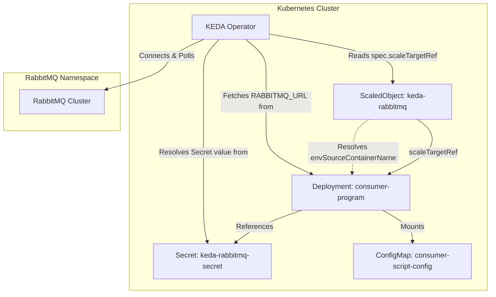

# Lab Exercise 8.1: Exploring Basic Authentication Mechanisms

This exercise explores how KEDA can authenticate and connect to event sources using environment variables defined directly in the target deployment workload. 

Instead of hardcoding a connection string or referencing a KEDA `TriggerAuthentication` resource, we configure the `ScaledObject` to resolve authentication details dynamically. This is done by specifying:
- `hostFromEnv: RABBITMQ_URL`: Instructs KEDA to fetch the connection URL from the specified environment variable.
- `scaleTargetRef.envSourceContainerName: consumer-program`: Tells KEDA which container in the target pod contains that environment variable.

---

## 🏗️ Architecture & Authentication Resolution



---

## Prerequisites

1. Basic understanding of Kubernetes and KEDA.
2. Running RabbitMQ Cluster (deployed under the `rabbitmq` namespace as per previous labs).
3. HashiCorp Vault installed via Helm (for future exercises in this chapter):
   ```bash
   helm repo add hashicorp https://helm.releases.hashicorp.com
   helm repo update hashicorp
   helm upgrade -i vault hashicorp/vault --set "server.dev.enabled=true" -n vault --create-namespace
   ```

---

## 📂 Manifests

### 1. RabbitMQ Credentials Secret (`secret.yaml`)
Stores the base64-encoded AMQP connection string.
```yaml
apiVersion: v1
kind: Secret
metadata:
  name: keda-rabbitmq-secret
type: Opaque
data:
  host: YW1xcDovL2RlZmF1bHRfdXNlcl9obUdaRmhkZXdxNjVQNGRJZHg3OnFjOThuNGlHRDdNWVhNQlZGY0lPMm10QjV2b0R1Vl9uQHJhYmJpdG1xLWNsdXN0ZXIucmFiYml0bXEuc3ZjLmNsdXN0ZXIubG9jYWw6NTY3Mg==
```

### 2. Consumer Workload (`consumer.yaml`)
Deploys a consumer script ConfigMap and a single-replica Deployment that references the credentials secret.
```yaml
apiVersion: v1
kind: ConfigMap
metadata:
  name: consumer-script-config
data:
  consumer-script.sh: |
    #!/bin/bash
    currentMessage=""
    handle_sigterm() {
      if [ -n "$currentMessage" ]; then
        echo "SIGTERM signal received while processing a message."
        curl -X POST http://result-analyzer-service:8080/kill/count -s
        echo "Kill count HTTP request sent."
      else
        echo "SIGTERM signal received, but no message was being processed."
      fi
      exit 0
    }
    trap 'handle_sigterm' SIGTERM
    while true; do
      echo -e "Waiting for message...\n"
      if ! currentMessage=$(amqp-consume --url="$RABBITMQ_URL" -q "testqueue" -c 1 cat); then
        echo -e "Error occurred during message consumption. Exiting...\n"
        continue
      fi
      echo -e "Message received, processing: $currentMessage \n"
      i=1
      while [ $i -le 360 ]; do
        echo "Encoding video $i"
        sleep 1
        i=$((i+1))
      done
      currentMessage=""
      curl -X POST http://result-analyzer-service:8080/create/count -s
      echo -e "Waiting for next message...\n"
    done
---
apiVersion: apps/v1
kind: Deployment
metadata:
  name: consumer-program
spec:
  replicas: 1
  selector:
    matchLabels:
      app: consumer-program
  template:
    metadata:
      labels:
        app: consumer-program
    spec:
      containers:
      - name: consumer-program
        image: ghcr.io/kedify/blog05-cli-consumer-program:latest
        command: ["/bin/bash"]
        args: ["/scripts/consumer-script.sh"]
        volumeMounts:
        - name: script-volume
          mountPath: /scripts
        env:
        - name: RABBITMQ_URL
          valueFrom:
            secretKeyRef:
              name: keda-rabbitmq-secret
              key: host
      volumes:
      - name: script-volume
        configMap:
          name: consumer-script-config
```

### 3. ScaledObject with Direct Env Secret (`scaled-object-direct-secret.yaml`)
Configures autoscaling using `hostFromEnv` to dynamically resolve the RabbitMQ host address.
```yaml
apiVersion: keda.sh/v1alpha1
kind: ScaledObject
metadata:
  name: keda-rabbitmq
spec:
  scaleTargetRef:
    name: consumer-program
    envSourceContainerName: consumer-program
  triggers:
  - type: rabbitmq
    metadata:
      protocol: amqp
      queueName: testqueue
      hostFromEnv: RABBITMQ_URL
      queueLength: "5"
```

---

## 🛠️ Step-by-Step Lab Walkthrough

### 1. Deploy the Consumer Workload
1. Deploy the Secret, ConfigMap, and the deployment workload:
   ```bash
   kubectl apply -f secret.yaml
   kubectl apply -f consumer.yaml
   ```

2. Verify that the consumer deployment pod is running:
   ```bash
   kubectl get pods
   ```

### 2. Deploy the ScaledObject
1. Apply the ScaledObject configuration:
   ```bash
   kubectl apply -f scaled-object-direct-secret.yaml
   ```

2. Verify the ScaledObject readiness:
   ```bash
   kubectl get scaledobjects.keda.sh keda-rabbitmq
   ```
   *Expected Output:*
   ```text
   NAME            SCALETARGETKIND      SCALETARGETNAME    MIN   MAX   READY   ACTIVE    FALLBACK   PAUSED   TRIGGERS   AUTHENTICATIONS   AGE
   keda-rabbitmq   apps/v1.Deployment   consumer-program               True    Unknown   False      False    rabbitmq                     6s
   ```
   > [!NOTE]
   > The `READY: True` status confirms that KEDA successfully inspected the `consumer-program` deployment, extracted the `RABBITMQ_URL` environment variable from the designated container, resolved the secret value, and established a connection to the RabbitMQ cluster.

---

## 🧹 Clean Up

To clean up all resources created in this exercise:
```bash
kubectl delete -f scaled-object-direct-secret.yaml
kubectl delete -f consumer.yaml
kubectl delete -f secret.yaml
```