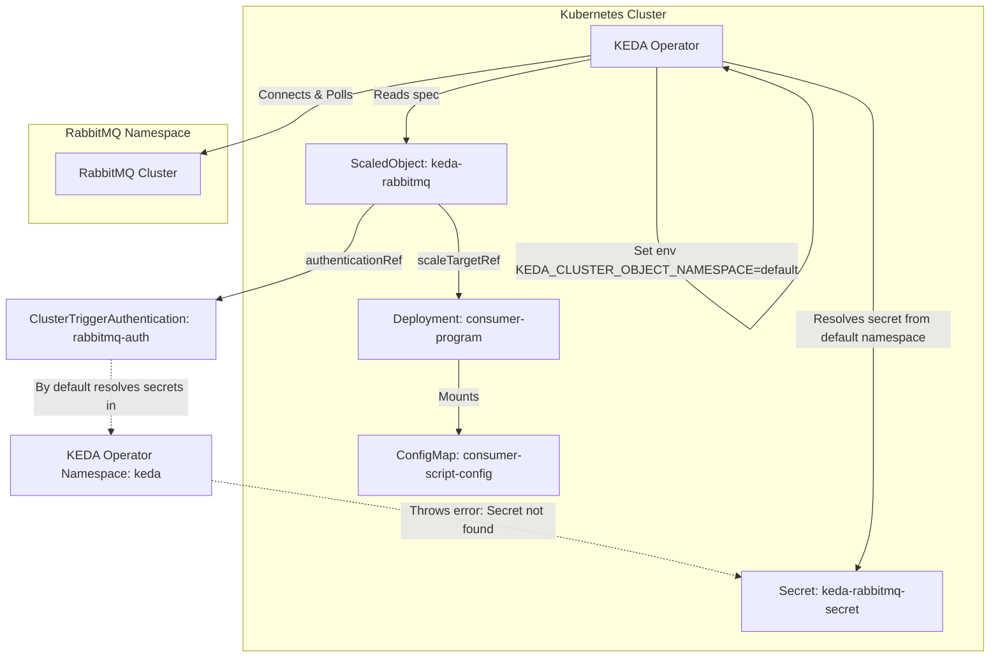

# Lab Exercise 8.5: Understanding and Configuring ClusterTriggerAuthentication

This exercise explores KEDA's cluster-scoped authentication resource: **ClusterTriggerAuthentication**.

Unlike a namespace-scoped `TriggerAuthentication`, a `ClusterTriggerAuthentication` can be reused by `ScaledObject` resources across any namespace in the cluster. This avoids repeating authentication configs in every namespace.

---

## 🏗️ Architecture & Secret Namespace Resolution Flow



### The Namespace Gotcha
Because `ClusterTriggerAuthentication` is cluster-scoped, it has no native namespace. By default, KEDA resolves its secret references in the namespace where the KEDA operator itself is installed (usually `keda`).
If the target Secret resides in a different namespace (e.g., `default`), KEDA will fail to locate it, and the `ScaledObject` will show `READY: False`. To fix this, we must configure KEDA operator's environment variable `KEDA_CLUSTER_OBJECT_NAMESPACE` to look in the target namespace.

---

## 📊 Comparison of KEDA Authentication Methods (Labs 21-24)

Here is a comparison of the different credentials-handling models explored in Labs 21 through 24:

| Lab | Authentication Resource | Where KEDA Resolves the Secret | Key Architectural Difference | Security/Operational Benefit |
| :--- | :--- | :--- | :--- | :--- |
| **Lab 21** | `TriggerAuthentication` | **Workload Container Environment** | KEDA reads the target Pod's environment variables (`env` matching `RABBITMQ_URL`) to find the credentials. | Simple, but requires the credential to be mounted/exposed directly as an environment variable inside the workload pod. |
| **Lab 22** | `TriggerAuthentication` | **Kubernetes Secret** | KEDA references the Kubernetes Secret (`secretTargetRef`) directly. | Workloads do **not** need to expose this credential in their container environment. Only KEDA reads the secret directly from the Kubernetes API. |
| **Lab 23** | `TriggerAuthentication` | **External Secret Store (HashiCorp Vault)** | KEDA uses a token to query Vault's API (`hashiCorpVault`) and retrieve the credential dynamically at runtime. | Maximum security. The secret does not even need to exist as a native Kubernetes Secret resource in the cluster. |
| **Lab 24** | `ClusterTriggerAuthentication` | **Cluster-Scoped Secret** | Uses a cluster-scoped CRD (`ClusterTriggerAuthentication`) instead of namespace-scoped. | **Reusability.** Multiple `ScaledObject` resources across different namespaces can reuse this single authentication resource, reducing duplication. |

---

## Prerequisites

1. Basic understanding of Kubernetes and KEDA.
2. Running RabbitMQ Cluster (deployed under the `rabbitmq` namespace as per previous labs).
3. Completion of Lab Exercise 8.4.

---

## 📂 Manifests

### 1. RabbitMQ Credentials Secret (`secret.yaml`)
Stores the base64-encoded AMQP connection string in the `default` namespace.
```yaml
apiVersion: v1
kind: Secret
metadata:
  name: keda-rabbitmq-secret
type: Opaque
data:
  host: YW1xcDovL2RlZmF1bHRfdXNlcl9obUdaRmhkZXdxNjVQNGRJZHg3OnFjOThuNGlHRDdNWVhNQlZGY0lPMm10QjV2b0R1Vl9uQHJhYmJpdG1xLWNsdXN0ZXIucmFiYml0bXEuc3ZjLmNsdXN0ZXIubG9jYWw6NTY3Mg==
```

### 2. Consumer Workload (`consumer.yaml`)
Deploys the consumer workload in the `default` namespace.
```yaml
apiVersion: v1
kind: ConfigMap
metadata:
  name: consumer-script-config
data:
  consumer-script.sh: |
    #!/bin/bash
    currentMessage=""
    handle_sigterm() {
      if [ -n "$currentMessage" ]; then
        echo "SIGTERM signal received while processing a message."
        curl -X POST http://result-analyzer-service:8080/kill/count -s
        echo "Kill count HTTP request sent."
      else
        echo "SIGTERM signal received, but no message was being processed."
      fi
      exit 0
    }
    trap 'handle_sigterm' SIGTERM
    while true; do
      echo -e "Waiting for message...\n"
      if ! currentMessage=$(amqp-consume --url="$RABBITMQ_URL" -q "testqueue" -c 1 cat); then
        echo -e "Error occurred during message consumption. Exiting...\n"
        continue
      fi
      echo -e "Message received, processing: $currentMessage \n"
      i=1
      while [ $i -le 360 ]; do
        echo "Encoding video $i"
        sleep 1
        i=$((i+1))
      done
      currentMessage=""
      curl -X POST http://result-analyzer-service:8080/create/count -s
      echo -e "Waiting for next message...\n"
    done
---
apiVersion: apps/v1
kind: Deployment
metadata:
  name: consumer-program
spec:
  replicas: 1
  selector:
    matchLabels:
      app: consumer-program
  template:
    metadata:
      labels:
        app: consumer-program
    spec:
      containers:
      - name: consumer-program
        image: ghcr.io/kedify/blog05-cli-consumer-program:latest
        command: ["/bin/bash"]
        args: ["/scripts/consumer-script.sh"]
        volumeMounts:
        - name: script-volume
          mountPath: /scripts
        env:
        - name: RABBITMQ_URL
          valueFrom:
            secretKeyRef:
              name: keda-rabbitmq-secret
              key: host
      volumes:
      - name: script-volume
        configMap:
          name: consumer-script-config
```

### 3. ClusterTriggerAuthentication & ScaledObject (`scaled-object-cluster-trigger.yaml`)
Configures a cluster-scoped `ClusterTriggerAuthentication` and links it to a `ScaledObject` in the `default` namespace.
```yaml
apiVersion: keda.sh/v1alpha1
kind: ClusterTriggerAuthentication
metadata:
  name: rabbitmq-auth
spec:
  secretTargetRef:
  - parameter: host
    key: host
    name: keda-rabbitmq-secret
---
apiVersion: keda.sh/v1alpha1
kind: ScaledObject
metadata:
  name: keda-rabbitmq
  namespace: default
spec:
  scaleTargetRef:
    name: consumer-program
  triggers:
  - type: rabbitmq
    metadata:
      protocol: amqp
      queueName: testqueue
      queueLength: "5"
    authenticationRef:
      kind: ClusterTriggerAuthentication
      name: rabbitmq-auth
```

---

## 🛠️ Step-by-Step Lab Walkthrough

### 1. Deploy the Workload
1. Deploy the Secret, ConfigMap, and Deployment in the `default` namespace:
   ```bash
   kubectl apply -f secret.yaml
   kubectl apply -f consumer.yaml
   ```

2. Confirm the consumer pod is running:
   ```bash
   kubectl get pods
   ```

### 2. Deploy ClusterTriggerAuthentication & ScaledObject (Initial Attempt)
1. Apply the combined configuration:
   ```bash
   kubectl apply -f scaled-object-cluster-trigger.yaml
   ```

2. Check the status of the ScaledObject:
   ```bash
   kubectl get scaledobjects.keda.sh keda-rabbitmq
   ```
   *Expected Output:*
   ```text
   NAME            SCALETARGETKIND      SCALETARGETNAME    MIN   MAX   READY   ACTIVE    FALLBACK   PAUSED   TRIGGERS   AUTHENTICATIONS   AGE
   keda-rabbitmq   apps/v1.Deployment   consumer-program               False   Unknown   False      False    rabbitmq   rabbitmq-auth     8s
   ```
   > [!WARNING]
   > Notice that `READY` is `False`. The KEDA operator controller log will show a secret-not-found error because KEDA is searching for `keda-rabbitmq-secret` in the `keda` namespace.

---

### 3. Configure the KEDA Operator
To resolve this, set the KEDA operator's environment variable `KEDA_CLUSTER_OBJECT_NAMESPACE` to the `default` namespace so it can locate the secret.

1. Update the operator deployment environment:
   ```bash
   kubectl set env -n keda deployment/keda-operator KEDA_CLUSTER_OBJECT_NAMESPACE=default
   ```

2. Wait for the KEDA operator pod to restart and become ready:
   ```bash
   kubectl get pods -n keda -w
   ```

3. Recheck the status of your ScaledObject:
   ```bash
   kubectl get scaledobjects.keda.sh keda-rabbitmq
   ```
   *Expected Output:*
   ```text
   NAME            SCALETARGETKIND      SCALETARGETNAME    MIN   MAX   READY   ACTIVE    FALLBACK   PAUSED   TRIGGERS   AUTHENTICATIONS   AGE
   keda-rabbitmq   apps/v1.Deployment   consumer-program               True    Unknown   False      False    rabbitmq   rabbitmq-auth     12s
   ```
   > [!NOTE]
   > Now `READY` is `True`. The operator successfully resolved the secret from the `default` namespace!

---

## 🧹 Clean Up

To clean up all resources created in this exercise and restore KEDA operator environment:
```bash
kubectl delete -f scaled-object-cluster-trigger.yaml
kubectl delete -f consumer.yaml
kubectl delete -f secret.yaml
kubectl set env -n keda deployment/keda-operator KEDA_CLUSTER_OBJECT_NAMESPACE-
```
> [!NOTE]
> The final command removes the custom namespace setting from the operator.