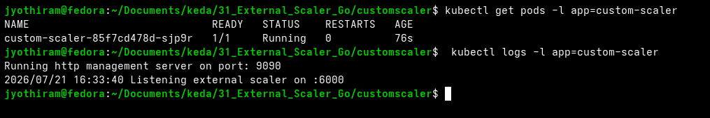

# Lab Exercise 11.2 Containerizing and Deploying the External Scaler in Kubernetes


# Lab Exercise 11.2: Containerizing and Deploying

the External Scaler in Kubernetes
In this exercise we will containerize the custom scaler application we created in the Lab Exercise 11.1 and
deploy in it Kubernetes.

## Prerequisites

1. Basic understanding of Kubernetes and KEDA.
2. Access to a Kubernetes environment with KEDA and Metric Server installed as per Lab 5.
3. Completion of Lab Exercise 11.1.

## Lab Exercise

1. Create a Dockerfile:
Create a file named Dockerfile with the following contents and build a Docker image using the command
below.
```dockerfile
FROM golang:1.25 as builder
WORKDIR /src
COPY . .
RUN CGO_ENABLED=0 GOOS=linux GOARCH=amd64 GO111MODULE=on go build -a -o external-scaler .

FROM gcr.io/distroless/static:nonroot
WORKDIR /
COPY --from=builder /src/external-scaler .
ENTRYPOINT ["/external-scaler"]
```
```bash
# Build the image using podman or docker
podman build -t ttl.sh/jyothiram-custom-scaler:1h -f Dockerfile .
# Push the image to the temporary registry
podman push ttl.sh/jyothiram-custom-scaler:1h
```
2. Deploy custom scaler In Kubernetes:
Create a file named scaler-deployment.yaml with the following contents and apply it using the command
below. Be sure to replace the image field with the respective image name you created while executing
the command in step 1.
```yaml
apiVersion: v1
kind: Service
metadata:
  name: custom-scaler
spec:
  selector:
    app: custom-scaler
  ports:
  - protocol: TCP
    port: 9090
    targetPort: 9090
    name: http
  - protocol: TCP
    port: 6000
    targetPort: 6000
    name: grpc
---
apiVersion: apps/v1
kind: Deployment
metadata:
  name: custom-scaler
spec:
  replicas: 1
  selector:
    matchLabels:
      app: custom-scaler
  template:
    metadata:
      labels:
        app: custom-scaler
    spec:
      containers:
      - name: custom-scaler
        imagePullPolicy: Always
        image: ttl.sh/jyothiram-custom-scaler:1h
        ports:
        - containerPort: 9090
          name: http
        - containerPort: 6000
          name: grpc
```
```bash
kubectl apply -f scaler-deployment.yaml
```
3. Verify custom scaler:
```bash
kubectl get deployments.apps custom-scaler
```
Expected Output:
```text
NAME            READY   UP-TO-DATE   AVAILABLE   AGE
custom-scaler   1/1     1            1           3h26m
```

Verify that the custom scaler pod is running and listening on port `:6000`:
```bash
kubectl get pods -l app=custom-scaler
kubectl logs -l app=custom-scaler
```

Verification Screenshot:


## Summary

In this exercise, we successfully containerized and deployed the custom scaler application in Kubernetes.