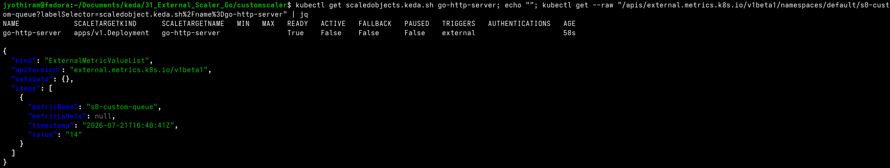
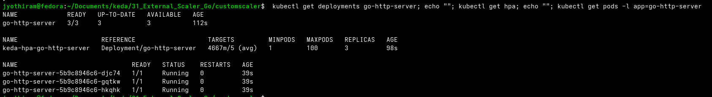

# Lab Exercise 11.3: Testing and Observing Custom Scaler


## Architecture Workflow

Below is the architecture diagram illustrating how KEDA interacts with our custom scaler to autoscale the consumer application:

```mermaid
graph TD
    classDef default fill:#2e3440,stroke:#88c0d0,stroke-width:2px,color:#d8dee9;
    classDef client fill:#bf616a,stroke:#bf616a,stroke-width:2px,color:#ffffff;
    classDef k8s fill:#81a1c1,stroke:#81a1c1,stroke-width:2px,color:#ffffff;
    classDef custom fill:#a3be8c,stroke:#a3be8c,stroke-width:2px,color:#ffffff;

    User["Client / Operator (curl)"]:::client
    API["Custom Scaler HTTP API (Port 9090)"]:::custom
    MetricStore[("Custom Queue State")]:::custom
    Loop["Background Decrement Loop (60s)"]:::custom
    gRPC["Custom Scaler gRPC Server (Port 6000)"]:::custom
    KEDA["KEDA Operator"]:::k8s
    HPA["Kubernetes HPA"]:::k8s
    Consumer["Consumer App (go-http-server)"]:::k8s

    User -->|1. Set Queue Length (POST)| API
    API -->|Update Value| MetricStore
    Loop -->|Decrement Value by 1| MetricStore
    KEDA -->|2. Query Metrics (GetMetrics/IsActive)| gRPC
    gRPC -->|Read State| MetricStore
    KEDA -->|3. Feed Metrics| HPA
    HPA -->|4. Autoscale Pods| Consumer
```

## Prerequisites


1. Basic understanding of Kubernetes and KEDA.
2. Access to a Kubernetes environment with KEDA and Metric Server installed as per Lab 5.
3. The go-http-server created in Lab 2.
4. Completion of Lab Exercises 11.1 and 11.2

## Lab Exercise

1. Deploy Custom Queue consumer application:
This is the target deployment of our ScaledObject. We are using the same go-http-server that we created in
Lab 2.
Note: This application does not talk to Custom Queue. We are using it just for demonstration purposes. The
actual consuming behavior is taken care of by the custom scaler (the background function reduces the length
of the queue by one every minute).
Create a file named consumer-deployment.yaml with the following contents and apply it using the
command below. Be sure to replace the image field with the respective image name you created in Lab
02.
```yaml
apiVersion: apps/v1
kind: Deployment
metadata:
  name: go-http-server
spec:
  replicas: 1
  selector:
    matchLabels:
      app: go-http-server
  template:
    metadata:
      labels:
        app: go-http-server
    spec:
      containers:
      - name: go-http-server
        imagePullPolicy: Always
        image: ttl.sh/jyothiram-go-http-server:2h
        ports:
        - containerPort: 8080
          name: http
        resources:
          requests:
            cpu: "20m"
          limits:
            cpu: "50m"
```
```bash
kubectl apply -f consumer-deployment.yaml
```
.
2. Create custom scaler ScaledObject:
As discussed in the chapter, for custom scalers we use the trigger type external and provide the scalerAddress
in the metadata field. Optionally, you can also pass any additional information such as queueLength which
will be used by the scaler to take decisions.
Create a file named scaledobject.yaml with the following contents and apply it using the command below.
```yaml
apiVersion: keda.sh/v1alpha1
kind: ScaledObject
metadata:
name: go-http-server
spec:
scaleTargetRef:
name: go-http-server
triggers:
- type: external
metadata:
scalerAddress: custom-scaler.default.svc.cluster.local:6000
queueLength: "5"
```
```bash
kubectl apply -f scaledobject.yaml
```
3. Verify ScaledObject:
Use the following command to check the status of ScaledObject.
```bash
kubectl get scaledobjects.keda.sh go-http-server
```
NAME SCALETARGETKIND SCALETARGETNAME MIN MAX TRIGGERS
AUTHENTICATION READY ACTIVE FALLBACK PAUSED AGE
go-http-server apps/v1.Deployment go-http-server external
True False False Unknown 2m10s
Use the command below to check the metric name and its current value.
```bash
kubectl get scaledobject go-http-server -n default -o
```
jsonpath={.status.externalMetricNames}
["s0-custom-queue"]
```bash
kubectl get --raw
```
"/apis/external.metrics.k8s.io/v1beta1/namespaces/default/s0-custom-queue?labelSe
l
ector=scaledobject.keda.sh%2Fname%3Dgo-http-server" | jq
{
"kind": "ExternalMetricValueList",
"apiVersion": "external.metrics.k8s.io/v1beta1",
"metadata": {},
"items": [
{
"metricName": "s0-custom-queue",
"metricLabels": null,
"timestamp": "2024-02-08T03:57:31Z",
"value": "0"
}
]
}
4. Set the queue length of Custom Queue:
In this step, we are establishing a port forwarding rule that redirects network traffic from a specific port on your
local machine to the corresponding port on the Kubernetes pod hosting the custom scaler.
```bash
kubectl port-forward deployment/custom-scaler 9090:9090
```
```text
Forwarding from 127.0.0.1:9090 -> 9090
Forwarding from [::1]:9090 -> 9090
Handling connection for 9090
```
Execute the below curl request to set the custom queue length.
```bash
curl -X POST localhost:9090/api/queue/15
```

Use the following command to check the current metric value.
```bash
kubectl get --raw "/apis/external.metrics.k8s.io/v1beta1/namespaces/default/s0-custom-queue?labelSelector=scaledobject.keda.sh%2Fname%3Dgo-http-server" | jq
```
Expected Output:
```json
{
  "kind": "ExternalMetricValueList",
  "apiVersion": "external.metrics.k8s.io/v1beta1",
  "metadata": {},
  "items": [
    {
      "metricName": "s0-custom-queue",
      "metricLabels": null,
      "timestamp": "2026-07-21T16:40:41Z",
      "value": "14"
    }
  ]
}
```

Verification Screenshot (Metric Value):



5. Verify the autoscaling behavior:
```bash
kubectl get hpa --watch
```
Expected Output:
```text
NAME                      REFERENCE                   TARGETS         MINPODS   MAXPODS   REPLICAS   AGE
keda-hpa-go-http-server   Deployment/go-http-server   <unknown>/5     1         100       1          4m14s
keda-hpa-go-http-server   Deployment/go-http-server   13/5 (avg)      1         100       1          5m
keda-hpa-go-http-server   Deployment/go-http-server   4/5 (avg)       1         100       3          6m
keda-hpa-go-http-server   Deployment/go-http-server   3667m/5 (avg)   1         100       3          7m
keda-hpa-go-http-server   Deployment/go-http-server   3334m/5 (avg)   1         100       3          8m
keda-hpa-go-http-server   Deployment/go-http-server   3/5 (avg)       1         100       3          9m
keda-hpa-go-http-server   Deployment/go-http-server   2667m/5 (avg)   1         100       3          10m
keda-hpa-go-http-server   Deployment/go-http-server   2334m/5 (avg)   1         100       3          11m
keda-hpa-go-http-server   Deployment/go-http-server   2/5 (avg)       1         100       3          12m
keda-hpa-go-http-server   Deployment/go-http-server   2500m/5 (avg)   1         100       2          13m
keda-hpa-go-http-server   Deployment/go-http-server   2/5 (avg)       1         100       2          14m
keda-hpa-go-http-server   Deployment/go-http-server   1500m/5 (avg)   1         100       2          15m
keda-hpa-go-http-server   Deployment/go-http-server   1/5 (avg)       1         100       2          16m
keda-hpa-go-http-server   Deployment/go-http-server   500m/5 (avg)    1         100       2          17m
keda-hpa-go-http-server   Deployment/go-http-server   0/5 (avg)       1         100       1          18m
keda-hpa-go-http-server   Deployment/go-http-server   0/5 (avg)       1         100       1          22m
keda-hpa-go-http-server   Deployment/go-http-server   <unknown>/5     1         100       0          23m
```

Verification Screenshot (Autoscaling Behavior):



## Summary

In this exercise we deployed a consumer application and tested a custom scaler for autoscaling based on
custom queue length. It includes deploying a Go HTTP server as a target for the ScaledObject, creating a
ScaledObject with an external trigger that points to the custom scaler, and verifying autoscaling behavior
through Kubernetes commands. The exercise demonstrated autoscaling in action, using Kubernetes Horizontal
Pod Autoscaler (HPA) to manage the scaling based on the custom metrics provided by the custom scaler.